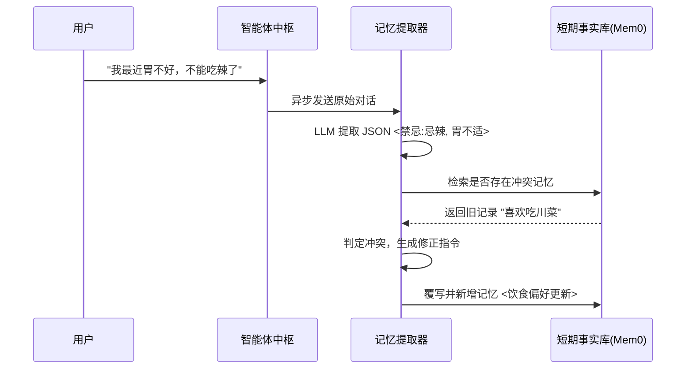
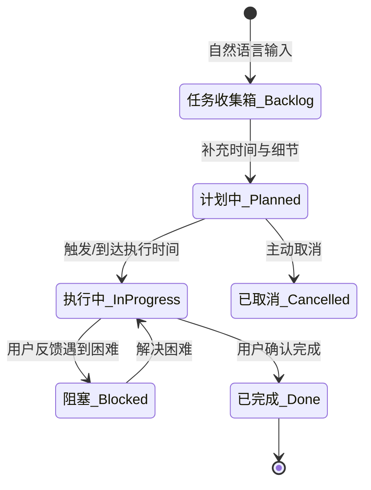
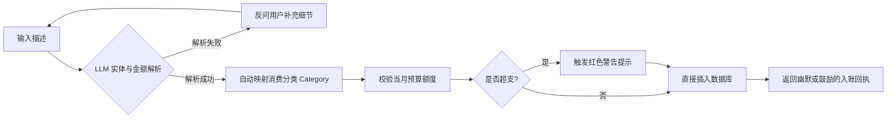
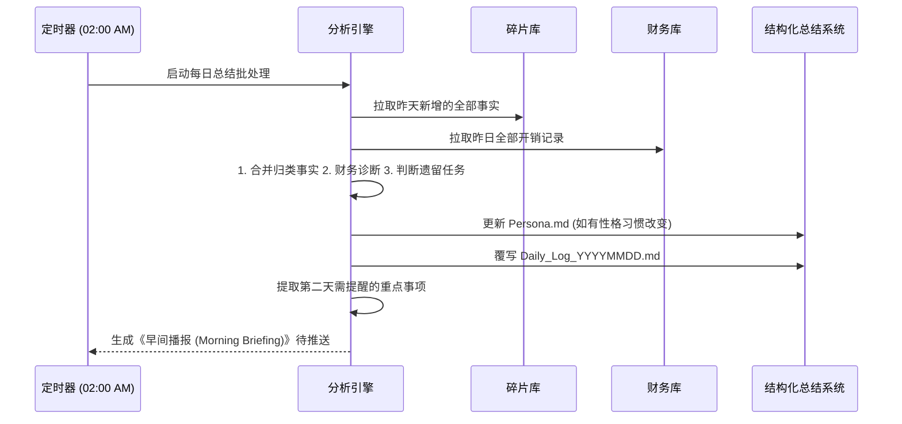

# 个人全能助理智能体 (PIC - Personal Intelligence Companion) 详细产品需求文档

## 1. 文档综述 (Document Overview)

### 1.1 产品背景与愿景
在信息碎片化时代，个人往往难以系统性地管理散落的日常事务、财务开销和长远规划。本产品旨在打造一款基于大语言模型（LLM）的**高智商个人全能助理 (PIC)**。它不仅是被动回答问题的机器人，而是具备“长短期结构化记忆”、“反思提纯能力”和“多维度工具调用”的数字分身。

### 1.2 核心业务价值
*   **认知外包**：用自然语言替代繁琐的 App 点击（如记账、写备忘录），降低用户的认知负荷。
*   **资产沉淀**：将随口提及的碎片信息（喜好、计划、人脉）结构化沉淀为个人生命资产表。
*   **前瞻干预**：通过数据反思（如账单超支预警、任务延期提醒），从被动响应转向主动管理。

---

## 2. 总体架构与业务流程 (System Architecture & Flow)

系统的核心在于其强大的“三层记忆引擎”和“意图路由机制”。用户的每次输入都会经过路由分配、记忆交叉对比，最终做出响应或静默执行工具。

### 2.1 核心交互脑图流程

```mermaid
graph TD
    A([用户多模态输入: 语音/文字/图片]) --> B{意图分类路由 (Intent Router)}
    
    B -->|日常闲聊/信息碎片| C[短期记忆处理 (Mem0)]
    B -->|明确任务规划| D[任务管理器 (Task Tool)]
    B -->|财务开销记录| E[财务系统 (Finance Tool)]
    B -->|信息查询/调频| F[长记忆读取 (memU)]
    
    C -->|提取原子事实| G[(向量数据库 Vector DB)]
    D -->|状态更新| H[(Markdown 结构化文件系统)]
    E -->|插入记录| I[(关系型数据库 PostgreSQL)]
    
    G -.-> J{上下文整合与思考}
    H -.-> J
    I -.-> J
    
    J --> K[LLM 综合推理生成]
    K --> L([反馈给用户 / 静默执行结束])
```

---

## 3. 核心功能及详细流程说明

### 3.1 模块一：全域碎片收集与认知引擎 (Omni-Capture)
基于 Mem0 架构，负责处理用户不经意流露的碎片化信息，并在后台自动进行特征提取和纠错。

**核心功能要求：**
1.  **静默记忆**：用户说“我今天喝了杯瑞幸，感觉很精神”，系统后台提取 `<用户-偏好-瑞幸咖啡>`。
2.  **冲突自动消解**：若库中已有“用户只喝星巴克”，LLM 需判断并更新为“用户主要喝星巴克，但也会喝瑞幸”。

**信息提取处理流程图：**


### 3.2 模块二：时间与任务管理 (Time & Task Manager)
不仅能记录待办，更能基于上下文理解任务的前置条件和紧急度。采用类似文件系统的 memU 框架存储。

**核心功能要求：**
1.  **宏观目标拆解**：用户提出“今年我要减肥 10 斤”，智能体会询问周期并自动生成月度拆解列表。
2.  **长程进度追踪**：每周主动与用户“对齐”一次长期未更新的任务进度。
3.  **状态机扭转**：支持 自然语言 改变状态（如“昨天说的买书任务我搞定了”）。

**任务状态转移图：**


### 3.3 模块三：全场景个人财务管家 (Finance Center)
通过自然语言和 OCR 解析替代传统记账软件，要求绝对的数据准确性，底层采用关系型数据库。

**核心功能要求：**
1.  **自然语言秒记**：“打车花了三十”、“中午麻辣烫 25.5”。
2.  **多实体拆分**：“超市一共买了 150，其中 50 是零食，100 是日用品”，系统需切分为两处账单。
3.  **月度警戒水位线**：预算设置，累计开销达 80% 和 100% 时自动拦截提示。

**记账自动分类与入账流程：**


### 3.4 模块四：生命维度知识库 (Life Knowledge Base - memU)
将高频的短期事实，定期“降维打击”成固定结构的 Markdown 档案。

**包含的默认档案集：**
*   `/Profile/Persona.md`：用户的基本画像（职业、性格、基础偏好）。
*   `/Relationships/Network.md`：重要人物关系谱卡片。
*   `/Guidelines/SOPs.md`：用户为智能体定下的行动准则（如“永远不要主动借钱给别人”）。

---

## 4. 核心自动化机制：每日夜间反思 (Agentic Reflection)
智能体必须具有“自主休整”的能力，这是区分死板工具和智能助手的核心。

**每日反思运转流程 (Cron Task)：**


---

## 5. 全天候用户体验旅程 (User Journey Map)

清晰定义用户在一天内与本助理交互的核心场景：

*   **🌅 早上 08:00 (主动唤醒)**：Agent 主动发送**《早间播报》**。包含：昨晚睡眠（如果接入穿戴数据）、昨天遗留的紧急任务 2 件、今日首个会议提醒、以及“昨天记账总花费85元”。
*   **💻 上午 11:00 (高频碎片交互)**：用户发送语音：“刚开完进度会，把写 RAL 项目周报列为今天下午的重要事项”。Agent 回复：“✅ 已添加到今日待办。是否需要我调出前两天的 RAL 开发日志供参考？”
*   **🥗 中午 12:30 (生活记录)**：用户拍一张午饭小票（68元）。Agent OCR 识别后自动落入 `餐饮` 分类，并回复：“小票收到，68元已计入餐饮开销。本月餐饮预算还剩 1,200 元。”
*   **🌙 晚上 23:00 (被动总结)**：用户说：“我今天太累了，准备睡了。”Agent 自动回复晚安，并标记系统进入休眠模式，等待凌晨 02:00 启动夜间反思机制。

---

## 6. 异常流与容错机制 (Exception Handling & Edge Cases)

由于受大模型幻觉与不确定性影响，必须定义以下产品兜底规则：

1.  **意图无法聚焦 (Ambiguous Intent)**：
    *   **触发条件**：用户输入极短或毫无逻辑的内容（如“这啥啊”、“算了”）。
    *   **处理策略**：LLM 置信度 `< 70%` 时，**严禁自行猜测与入库**，必须降级触发反问：“抱歉，我不太确定您的意思是让我记录这件事，还是只是跟我吐槽？”
2.  **高危操作拦截 (Critical Action Auth)**：
    *   **触发条件**：用户要求删除超过 5 条记忆、清空某个任务清单，或记账金额单笔异常（如 `> 10000元`）。
    *   **处理策略**：挂起任务状态，生成带有 `[按钮/确认词]` 的消息：“您正在执行高危操作：清空年度计划。请回复『确认清空』以生效。”
3.  **记忆纠错与回滚 (Memory Rollback)**：
    *   **触发条件**：Agent 从“我讨厌喝冰的”错误提取成了“喜欢喝冰的”。
    *   **处理策略**：任何被 Mem0 入库或 memU 写入的动作，在交互回执中必须隐式或显式地带有“若记录有误，回『撤回』即可”的提示，支持 1 轮对话内的快速 Undo。

---

## 7. 性能、成本与大模型约束策略 (Cost / Token Optimization)

在 AI 产品中，不计成本的全局调用是无法商业化落地的。产品需采用**“大杯+小杯模型组合”**策略：

1.  **路由与意图分类层 (Intent Classification)**：
    *   **策略**：调用响应极快、成本极低的模型（如 GPT-4o-mini 或 Llama-3-8B）。每次用户说话，它只判断意图去向（财务、聊天、任务等），不执行深层推理。
2.  **短期记忆与碎片提取层 (Mem0 Extraction)**：
    *   **策略**：采用后台异步处理（Asynchronous Batching）。积攒 3-4 句话后合并请求一次小模型，而非每说一句话请求一次，极大降低重复提取成本。
3.  **深夜反思与核心决策层 (Nightly Reflection / Deep Reason)**：
    *   **策略**：调用逻辑推理极强的高成本模型（如 GPT-4o / Claude 3.5 Sonnet）。因发生在深夜或重要任务节点，耗时几秒无大碍，但必须要保证推演 100% 准确。
4.  **上下文截断 (Context Trimming)**：
    *   **策略**：不允许每次对话把几万字的 memU 历史记录传给大模型。平时系统窗口仅维持最近 10 轮对话；只有触发相应工具时，才把特定的 `.md` 文件挂载为补丁传入。

---

## 8. UX/UI 呈现形态规范 (Presentation Guidelines)

尽量摒弃纯文本“糊脸”式的回复，利用 Markdown 和可视化组件构建高效率界面。

*   **列表式信息展现**：凡是超过两项的待办、计划，必须使用 Markdown 的 `- [ ]` 形式呈现。
*   **财务状态呈现**：记账回执必须高亮关键数字，如：`已入账：**¥45.0** (餐饮) | 月度剩余：**¥2,400**`。
*   **进度感知 (Loading State)**：当执行复杂检索（如跨月账单统计、深度记忆检索）时，前端必须有明显的“思考中 (Thinking...)”态，并最好能在终端打印出当前的动作：“*正在检索 3 月账单...* -> *正在计算分类比例...*”。

---

## 9. 核心成功指标体系 (Success KPIs)

1.  **产品粘性 (Retention & Engagement)**
    *   **核心指标 (North Star)**：次日留存率、第七日活跃率（用户是否养成了用它随手记录的习惯）。
    *   **辅助指标**：日均交互轮数（Daily Turns per User）。
2.  **工具准确性 (Tool Accuracy)**
    *   **核心指标**：人工干预修改率 (Manual Correction Rate) `< 5%`。即智能提取被用户事后“撤回”或“纠正”的比例。若 `>15%` 则说明提取逻辑存在严重缺陷。
3.  **性能指标 (System Performance)**
    *   **核心指标**：闲聊端到端延迟 (End-to-End Latency) `≤ 1.5s`；工具使用延迟 `≤ 3s`。

---

## 10. 演进路线图 (Future Roadmap)

*   **Phase 1 (MVP版本)：纯文本个人外脑**
    *   目标：跑通“意图路由库”。
    *   交付：支持文本记账、文本待办、短期偏好提取。核心跑通 Mem0 和 PostgreSQL。
*   **Phase 2 (进阶架构)：Markdown结构化体系与自动化反思**
    *   目标：建立“长期认知”。
    *   交付：全量引入 memU 体系，支持自动构建任务相关联链接；上线 `Nightly Batch` 睡前反思总结脚本。
*   **Phase 3 (全息助手)：多模态与工具生态**
    *   目标：扩展“感知器官”与“手脚”。
    *   交付：对接聊天软件（微信/钉钉/Telegram），支持语音直接对话和发票图片的自动报销/记账流程；接入日历/邮件 API 实行双向同步操作。
