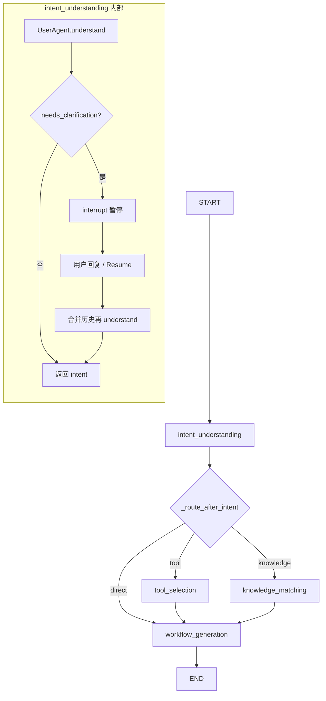

# 工作流编排 Graph 结构图

## 节点与边

```
                    ┌─────────────────────────────────────────────────────────┐
                    │                      START                               │
                    └─────────────────────────┬───────────────────────────────┘
                                              │
                                              ▼
                    ┌─────────────────────────────────────────────────────────┐
                    │              intent_understanding                        │
                    │  • UserAgent 理解意图 → EnhancedIntent                    │
                    │  • 若 needs_clarification → interrupt() 暂停，等用户回复   │
                    │  • 恢复后合并历史再理解，不再澄清 → 继续                    │
                    └─────────────────────────┬───────────────────────────────┘
                                              │
                         _route_after_intent (条件分发)
                                              │
              ┌───────────────────────────────┼───────────────────────────────┐
              │                               │                               │
              ▼                               ▼                               ▼
    ┌─────────────────┐             ┌─────────────────┐             ┌─────────────────┐
    │  needs_tool?    │             │ needs_knowledge?│             │ 两者都不需要     │
    │ tool_selection  │             │knowledge_matching│             │    direct       │
    └────────┬────────┘             └────────┬────────┘             └────────┬────────┘
             │                               │                               │
             │                               │                               │
             └───────────────────────────────┼───────────────────────────────┘
                                             │
                                             ▼
                    ┌─────────────────────────────────────────────────────────┐
                    │              workflow_generation                         │
                    │  • 汇聚 tool_plan + knowledge_match                      │
                    │  • WorkflowAgent 生成毕昇工作流 JSON                      │
                    └─────────────────────────┬───────────────────────────────┘
                                              │
                                              ▼
                    ┌─────────────────────────────────────────────────────────┐
                    │                        END                               │
                    └─────────────────────────────────────────────────────────┘
```

## 条件路由说明

| 意图条件 | 下一跳 |
|----------|--------|
| `needs_tool` 且 `needs_knowledge` | 并行：`tool_selection` + `knowledge_matching` → 都到 `workflow_generation` |
| 仅 `needs_tool` | `tool_selection` → `workflow_generation` |
| 仅 `needs_knowledge` | `knowledge_matching` → `workflow_generation` |
| 都不需要 | `direct` → 直接 `workflow_generation` |

## 多轮澄清（interrupt）

- 在 **intent_understanding** 节点内：若 `intent.needs_clarification == True`，会执行 `interrupt(pending)`，图暂停。
- 前端收到 `needs_clarification` 后展示澄清问题，用户回复同一 `session_id` 且 `isResume=true` 的请求。
- 编排器调用 `generate_resume(resume_value)`，图从该节点恢复；恢复时用「首轮输入 + 澄清问题 + 用户回复」作为多轮历史再调一次 `UserAgent.understand()`，合并为最终意图后 `needs_clarification=False`，继续走条件路由。

## Mermaid 版本（可渲染）


