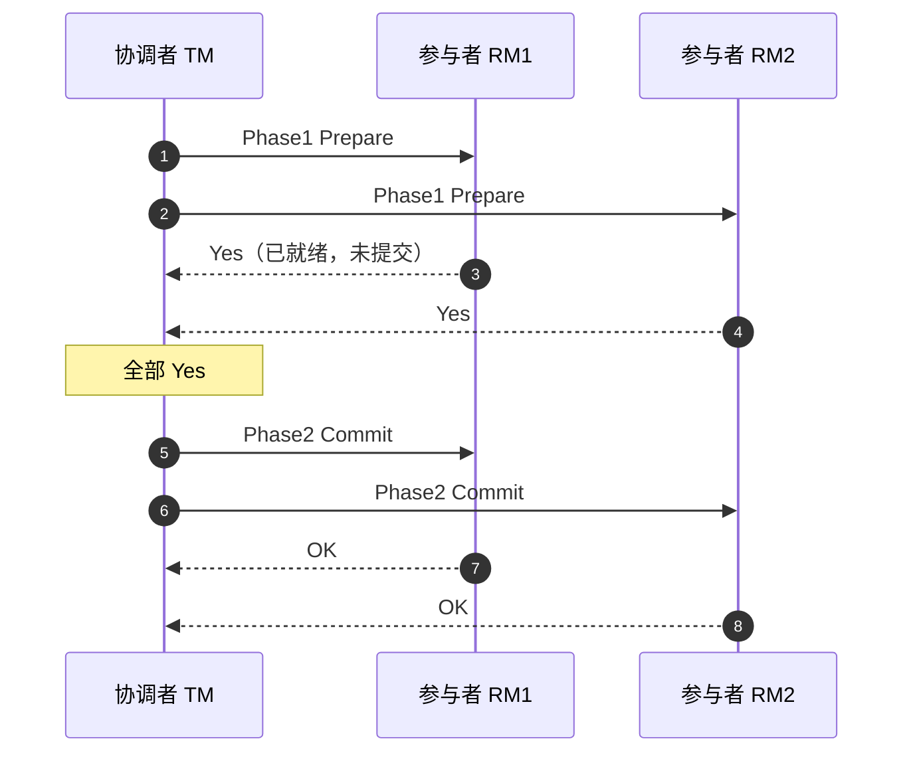
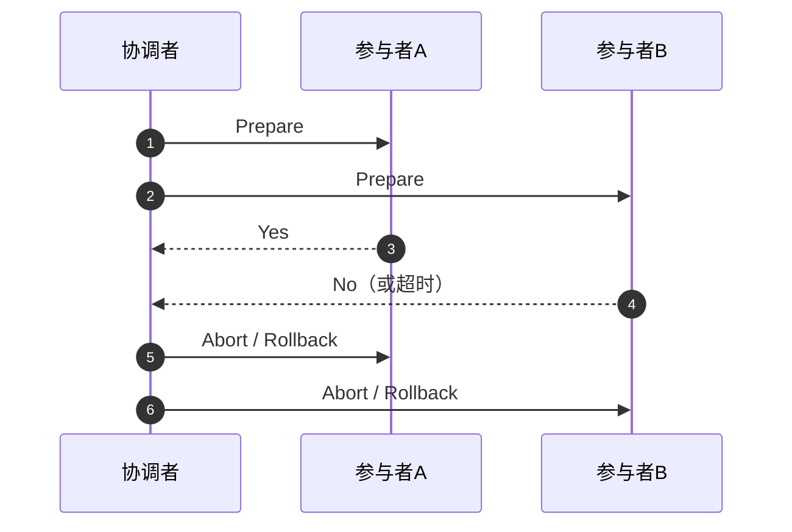
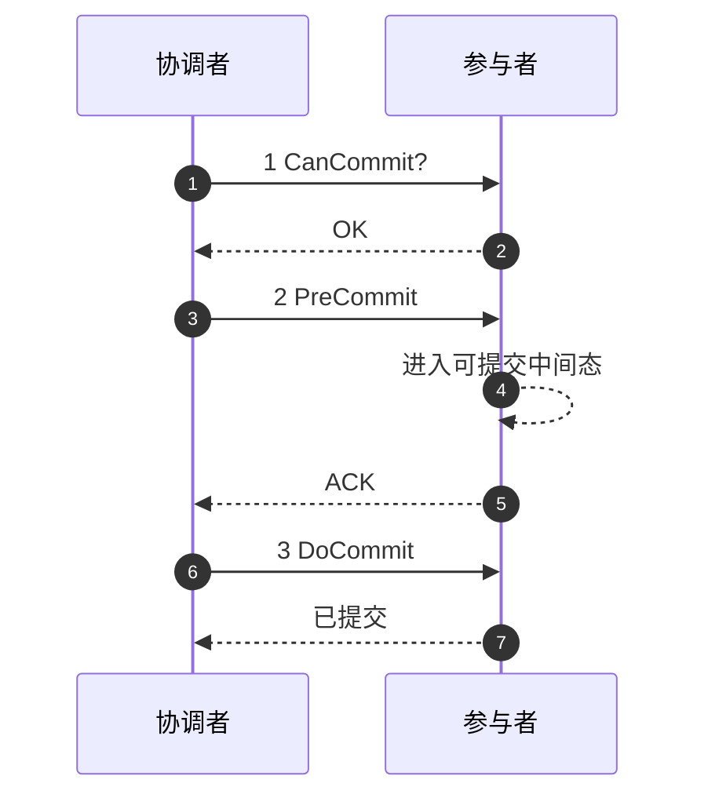
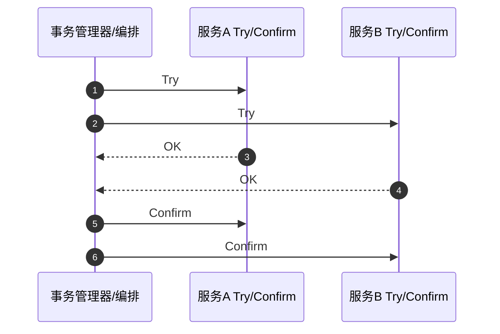
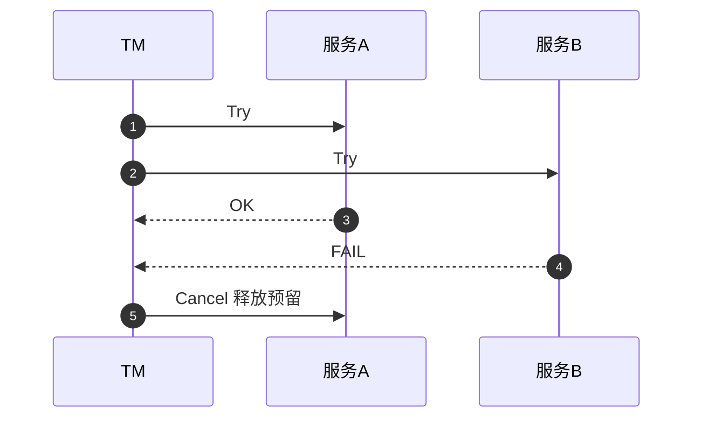
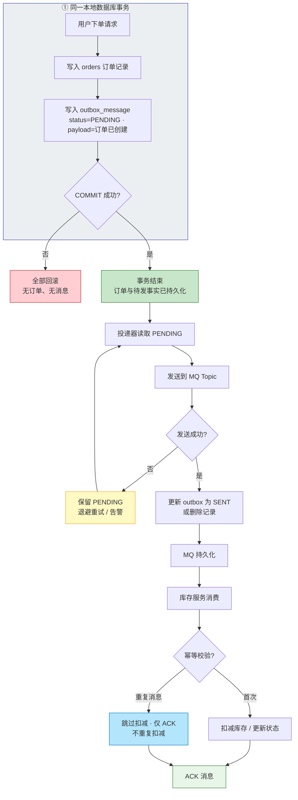
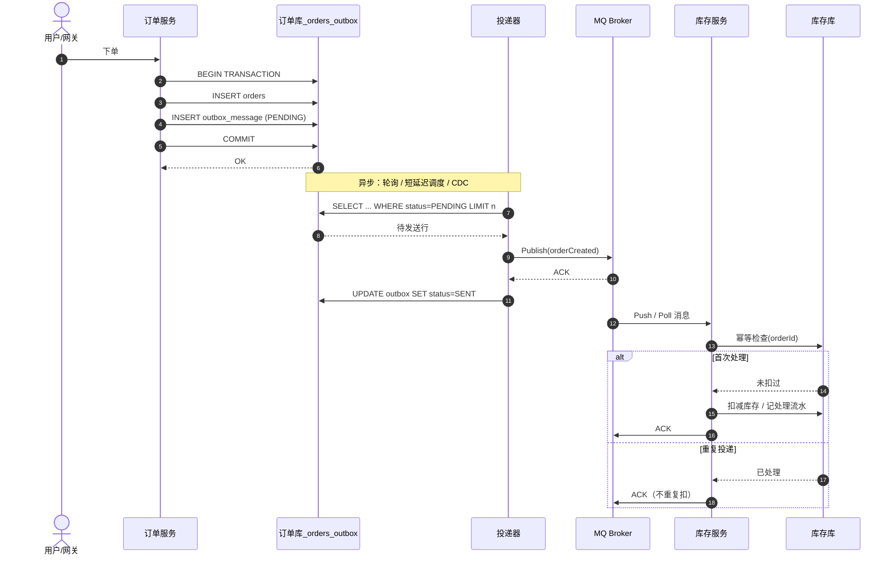
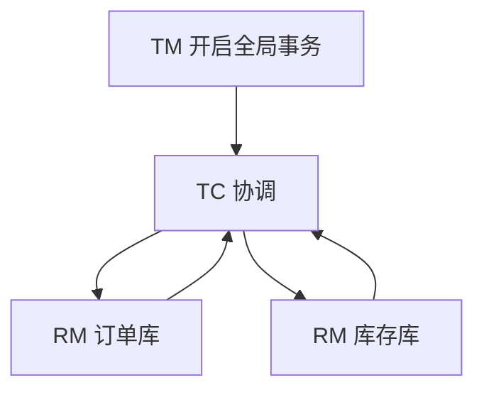
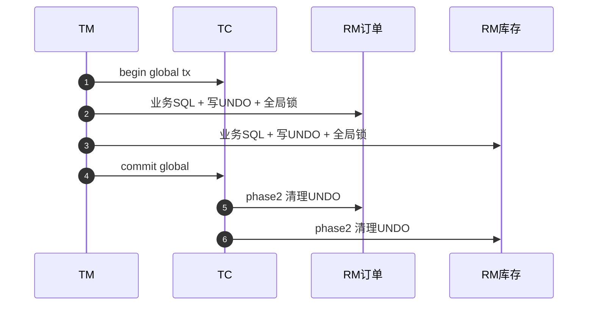

# 分布式事务高频面试题（2PC · TCC · Saga · 事务消息 · Seata · 实战落地）

> 面向 **分库分表 / 微服务** 下的 **一致性选型**。含**分层答法**、**（基础补充）**、**场景题**、**面经补充**与 **自测表**。**中间件版本以生产为准**。**Kafka EOS / MySQL 本地事务** 边界见 [kafka-interview.md](../kafka/kafka-interview.md)、[mysql-interview.md](../mysql/mysql-interview.md)。

---

## 目录

1. [基础概念与权衡](#一基础概念与权衡)
2. [两阶段与 XA](#二两阶段与-xa)
3. [TCC](#三tcc)
4. [Saga](#四saga)
5. [本地消息表、Outbox 与 MQ 事务消息](#五本地消息表outbox-与-mq-事务消息)
6. [Seata](#六seata)
7. [幂等、补偿与对账](#七幂等补偿与对账)
8. [实战场景题](#八实战场景题)
9. [面经高频补充](#九面经高频补充)
10. [自测清单](#十自测清单)

> **图文专节位置：** **第二节** 末 **2PC / 3PC**，**第三节** 末 **TCC**，**第六节** 末 **Seata**（均为 **Mermaid**，Markdown 预览即可渲染）。

> **复习：** 先能用一张图画出 **2PC 阻塞点** 与 **TCC 悬挂/空回滚**，再背 **Outbox vs 本地消息表** 与 **Seata AT 镜像回滚**；所有方案收口到 **幂等键 + 对账**。**二 / 三 / 六章** 末附有 **Mermaid 图文**（预览本文件即可渲染）。

---

## 一、基础概念与权衡

### 1. 什么是分布式事务？和本地事务区别？

**答：** **本地事务**：单数据源（或同一资源管理器边界），ACID 由单机数据库保证。**分布式事务**：**跨多个服务/库/消息系统** 的 **一组操作** 需要 **一致提交或一致回滚**（或接受 **明确的一致性强弱语义**）。  
**难点：** **网络分区、部分失败、性能、死锁时间拉长、运维复杂**。**面经收束：** 不要上来选最重方案；**多数业务** 可先 **最终一致 + 幂等 + 对账**。

---

### 2. CAP、BASE 和分布式事务有什么关系？

**答：**

| 概念 | 面试口述 |
|------|----------|
| **CAP** | **分区 P** 发生时，**C 与 A** **无法同时取极端**；系统多 **倾向 AP + 补偿** 或 **缩小强一致边界** |
| **BASE** | **基本可用、软状态、最终一致**——**短暂不一致可接受**，靠 **幂等 + 对账** |
| **方案映射** | **2PC/XA**：**延迟与锁**；**Outbox/TCC/Saga**：**性能与隔离换工程复杂度** |

**面试：** 先定 **业务一致级别**（资金 / 库存 / 积分档位可不同）再选型。

---

### 3. 「尽量不用分布式事务」是不是政治正确？

**答：** **是工程现实**：能用 **单科事务 + 领域边界收敛** 就不要硬跨。**但** 在 **多资源必须对齐**（如 **钱 + 单**、**券 + 单**）时，需要 **明确方案**。**拆分手段：** **业务幂等**、**状态机**（订单）、**对账**、**事务消息**、**编排器**。

---

### （基础补充）HTTP 「幂等键」与业务幂等？

**答：** **`Idempotency-Key`**（或业务 **requestId**）在 **网关 / 接入层** 或 **订单服务** 落 **唯一索引 / Redis NX**，使 **同一用户重复提交**（连点、客户端重试）只产生 **一次副作用**。与 **MQ 消费幂等**（**去重表、状态机**）同哲学：**至少一次投递 + 幂等处理 = 正确**。参见本仓 `spring-interview` 中 **Feign 重试与幂等**、MySQL 场景 **唯一键防重**。

---

## 二、两阶段与 XA

### 4. 2PC 两阶段提交流程与角色？

**答：**  
- **阶段一（Prepare）**：**协调者** 问各 **参与者**「能否提交？」；参与者执行事务 **但不提交**，写 **undo/redo**，答 **Yes/No**。  
- **阶段二（Commit/Abort）**：若 **全 Yes** → **Commit**；任一 **No/超时** → **Abort/Rollback**。  

**协调者单点、阻塞、长锁**：Prepare 后 **资源锁定** 直到全局结束 → **吞吐暴跌**。**协调者宕机** 时参与者可能 **不确定**（需 **超时策略、日志恢复** 等）。

---

### 5. 3PC 相对 2PC 改了什么？为何没普及？

**答：** 引入 **预提交** 阶段与 **超时推进** 试图 **降低阻塞**。**代价：** 更复杂、网络轮次更多；**仍无法完美解决** 网络分区下的语义问题。**工业界** 更倾向 **业务层方案 / XA 有限场景**。

---

### 6. XA 事务是什么？JTA 呢？

**答：** **XA** 是 **DTP** 模型下 **RM 与 TM** 的接口规范：由 **TM** 协调多个 **XA 资源**（多库）。**JTA**（Java）提供 **UserTransaction** 抽象。**Spring `JtaTransactionManager`** 常见配合 **Atomikos / Bitronix / Narayana**。**优点：** **对业务侵入小**、强一致。**缺点：** **锁定长、扩展差**、与 **拆分后的长链路** 不适配。

---

### （图文）2PC / 3PC：角色、场景、流程与时序

**图表说明：** 下方为 **Mermaid**，在 **Cursor / VS Code Markdown 预览** 或 **GitHub 浏览** 时可直接渲染。

#### 2PC 角色与阶段（与上文题 4、6 对照）

| 角色 | 职责 |
|------|------|
| **协调者（Coordinator / TM）** | 发起两阶段、收集投票、下发 Commit 或 Abort |
| **参与者（Participant / RM）** | 执行本地事务到「可提交」状态；Prepare 后持锁等待全局决定 |

**典型场景：** **跨库转账**（两个独立数据库）、**低并发核心账务** 在可接受延迟下追求 **协议级强一致**；与 **XA/JTA** 常一起出现（XA 定义接口，提交协议多为 **2PC**）。

**阻塞点（面试常画）：** Prepare 之后到 Commit/Abort 之前，参与者 **资源锁定**，协调者 **单点**；协调者宕机可能导致参与者 **长时间不确定**，依赖 **超时与恢复日志**。

#### 2PC 时序：全部成功

#### 2PC 时序：任一反对或超时 → 中止

#### 3PC 相对 2PC（与上文题 5 对照）

**思路：** 在「准备」与「最终提交」之间增加阶段（常见教材称 **CanCommit → PreCommit → DoCommit** 等，命名因资料略有差异），并引入 **超时推进**，试图 **减轻参与者无限期阻塞**。

**典型场景：** 多出现在 **教材、论文与协议讨论**；**工业界** 大规模默认选型仍多为 **2PC/XA 有限场景** 或 **业务层 TCC / Saga / 消息最终一致**。

**未普及原因：** **多一轮网络**、实现复杂；**网络分区** 下仍难同时满足极端 **CAP** 语义；工程上更愿用 **最终一致 + 幂等 + 对账**。

#### 3PC 概念时序（成功路径，简化）

#### 2PC vs 3PC 收口表

| 维度 | 2PC | 3PC |
|------|-----|-----|
| 轮次 | 2 阶段 | 通常 3 阶段 |
| 阻塞 | Prepare 后长锁窗口明显 | 试图用超时缓解，但代价是复杂度 |
| 工程地位 | XA 等仍可见 | **未成为** 主流微服务默认方案 |

---

## 三、TCC

### 7. TCC 三个字母分别做什么？

**答：** **Try**：**预留资源**（冻结库存、锁定金额）。**Confirm**：**确认提交**（真正扣减）。**Cancel**：**释放预留**。**特点：** **每个阶段都是本地事务**，**无全局行锁横跨整个 2PCprepare 窗口（但也要防悬挂与幂等）**。

---

### 8. TCC 的异常场景：空回滚、悬挂、幂等？

**答：**  
- **幂等**：**Confirm/Cancel 可能重试**，须 **业务幂等表** 或 **状态机**（只允许 **pending → confirm/cancel**）。  
- **空回滚**：**Try 未执行成功**（超时），**Cancel** 仍可能到达 → **需记录分支状态**，允许 **空回滚**。  
- **悬挂**：**Try 晚到**（网络延迟），在 **已 Cancel** 之后又执行 Try → **Try 前检查事务记录**，拒绝非法 Try。  

**面试：** 能画出 **时序乱序** 比背定义加分。

---

### 9. TCC 与 AT（下文 Seata）怎么选？

**答：** **TCC**：**性能上限高**、**无 UNDO_LOG 扫描**，**业务侵入大**。**AT**：**开发量小**，但有 **全局锁、镜像回滚、隔离性限制**，更适合 **CRUD 型业务快速落地**。

---

### （图文）TCC：阶段语义、场景、成功/失败时序

**图表说明：** **Mermaid** 同前，预览本文件即可。

#### 三阶段语义（与上文题 7、8 对照）

| 阶段 | 含义 | 库存示例 |
|------|------|----------|
| **Try** | **预留资源**，不完成最终业务副作用 | 冻结库存、写冻结流水 |
| **Confirm** | **确认**，消费预留 | 冻结转真实扣减 |
| **Cancel** | **取消**，释放预留 | 解冻库存 |

**特点：** 各阶段在**各服务内**均为 **本地事务**；**无** XA 那种跨库 **Prepare 长锁窗口**，但必须治理 **空回滚、悬挂、Confirm/Cancel 幂等**（题 8）。

**典型场景：** **库存 / 优惠券 / 余额** 等「预留 → 确认或释放」；**支付预授权**（Try≈冻结额度，Confirm≈扣款，Cancel≈释放）；**高并发** 下愿用 **业务复杂度** 换 **性能上限**。

#### 成功路径时序（两参与者）

#### 失败路径：某一 Try 失败 → 已 Try 分支 Cancel

#### 与 2PC / XA 的直观对比

| 维度 | 2PC / XA | TCC |
|------|----------|-----|
| 实现层 | 数据库/资源管理器 **协议** | **业务代码** 三接口 |
| 锁与吞吐 | Prepare 后 **阻塞窗口长** | 依赖 **预留模型**，通常更易控热点 |
| 代价 | 协调者与长锁 | **侵入大** + **幂等/悬挂/空回滚** 治理 |

---

## 四、Saga

### 10. Saga 是什么？编排 vs 协同？

**答：** **长事务拆分**为多步 **本地事务**，任一步失败则执行 **补偿**（逆操作）。**编排（Orchestration）**：**中心编排器** 驱动流程（状态清晰，**中心可用性** 要设计）。**协同（Choreography）**：各服务 **发事件接力**，**去中心化** 但 **观测与治理** 难。**面经：** **订单状态机 + 领域事件** 常 Hybrid。

---

### 11. Saga 的「隔离性」问题？

**答：** **缺乏传统 ACID 隔离**：其他事务可能 **读到中间态**。**缓解：** **语义锁、交换订单（reorder）、悲观视图、业务补偿路径**。**面试：** 承认 **隔离弱**，用 **产品规则** 收口。

---

## 五、本地消息表、Outbox 与 MQ 事务消息

### 12. 本地消息表模式流程？

**答：** **业务写 DB** 与 **插入消息表** 同事务提交；**后台任务扫描** `pending` 消息 **投递 MQ** → **成功后更新状态**。**优点：** **实现直观**。**缺点：** **轮询延迟**、**DB 压力**、需 **清理历史**。**改进：** **Outbox** + **Debezium CDC** 读 binlog 发 Kafka（减少轮询）。

---

### （图文）MQ + 本地消息表：流程图与时序图（电商下单 → 扣库存）

以下用 **同一业务场景** 串起：**订单服务** 本地落库 **订单 + Outbox**，**投递组件** 将消息发到 **MQ**，**库存服务** **幂等** 扣减。

**图表说明：** 下方正文使用 **Mermaid**，在 **Cursor / VS Code** 打开本文件后按 **Markdown 预览**（或 GitHub 网页浏览仓库）即可直接渲染，无需额外插件。若需要 **PlantUML** 主题与矢量导出，可使用同目录 [`diagrams/mq-outbox-flow.puml`](./diagrams/mq-outbox-flow.puml)、[`diagrams/mq-outbox-sequence.puml`](./diagrams/mq-outbox-sequence.puml) 在 [PlantUML 官网](https://www.plantuml.com/plantuml/uml) 或本地 PlantUML 插件中打开。

#### 场景设定

| 角色 | 职责 |
|------|------|
| **订单服务 + 同一库** | 同事务写入 `orders` 与 `outbox_message`（`PENDING`） |
| **投递器（Sender / Relay）** | 扫描或 CDC 触发，向 MQ 发送，成功后标记 `SENT` |
| **MQ** | 至少一次投递，可能重复 |
| **库存服务** | 按 `orderId` / `messageId` **幂等** 扣库存 |

#### 整体流程图（从下单到最终一致）

**读图要点：** 「业务事实」与「待发事件」在 **一个事务** 里对齐；**发 MQ** 在事务外，靠 **重试** 达到 **至少一次**；**最终一致** 靠消费端 **幂等** 收敛。

#### 时序图（组件交互）

**时序要点：** 订单与 Outbox 的 **BEGIN…COMMIT** 保证同事务；随后 **投递器 ↔ MQ ↔ 更新 outbox** 为异步投递（若先标 SENT 再发 MQ 失败，需可重发或补偿）；最后 **MQ → 库存** 体现 **至少一次投递 + 消费幂等**。

#### 与「最终一致」的对应关系

| 阶段 | 可能的不一致窗口 | 如何收口 |
|------|------------------|----------|
| Commit 后、投递前 | 订单已有，下游未收到 | 投递器重试直至 SENT |
| MQ 重复 | 库存可能收到多条 | 消费者 **幂等** |
| 消费失败 | 订单已建，库存未扣 | **重试 / DLQ** + **业务补偿**（关单、释放） |

---

### 13. Outbox 模式为何更「现代」？

**答：** **写库 Outbox 表**（事实与事件同事务）→ **CDC/relay** **可靠投递**到消息总线。**优点：** **避免** 业务代码里 **双写 MQ 与 DB 的原子性难题**。**代价：** **引入变更数据捕获链路** 的 **运维与语义学习成本**。

---

### 14. RocketMQ 事务消息的大致语义？

**答：** **半消息（Half）**：先保证 **对 MQ 可见性可控**，**本地事务执行并提交** 后 **二次确认 Commit**；否则 **Rollback** 或 **回查（check）**。**回查**：Broker/Producer **反查本地事务状态**（需 **实现幂等**）。**适用：** **既要 DB 又要发 MQ** 且 **接受最终一致**。**面经追问：** **回查接口** 如何 **映射业务状态**？

---

### 15. Kafka 有没有「原生事务消息」？

**答：** Kafka 有 **事务型 Producer**（**EOS 写入**），但与 **DB 同事务** 不是同一概念；**DB + Kafka** 常见仍是 **Outbox / 本地消息表 / 外部协调**。**避免** 把 **Kafka EOS** 与 **跨库分布式事务** 混为一谈。

---

## 六、Seata

### 16. Seata AT 一阶段、二阶段做什么？

**答：**  
- **一阶段**：业务 SQL **正常提交**；RM **拦截** 生成 **前后镜像（before/after image）** 写 **UNDO_LOG**，申请 **全局锁**。  
- **二阶段成功**：**异步删除 UNDO_LOG**、释放锁。  
- **二阶段回滚**：用 **镜像生成反向 SQL** 恢复，**脏写需处理**（见全局锁）。  

**优点：** **低侵入**。**缺点：** **镜像成本**、**隔离级别** 与 **全局锁等待**。

---

### 17. Seata AT 的全局锁解决什么问题？

**答：** 防止 **他处并发写同一行** 导致 **回滚覆盖**。**面试：** 与 **本地隔离级别、热点行** 的 **性能权衡**。

---

### 18. Seata 模式对比：AT / TCC / XA / Saga？

**答：** 简表（口径以官方文档为准）：

| 模式 | 侵入性 | 一致性/隔离 | 性能画像 | 典型场景 |
|------|--------|-------------|----------|----------|
| **AT** | 低 | 需理解全局锁 | 中上 | CRUD、快速接入 |
| **TCC** | 高 | 业务自控 | 高 | 高精度资金/库存预留 |
| **XA** | 低（对业务） | 强，锁长 | 偏低 | 兼容传统、低并发核心 |
| **Saga** | 中 | 弱隔离 | 高 | 长流程、可补偿 |

---

### 19. TC / TM / RM 分工？

**答：** **TC（Server）**：**事务协调**，维护 **全局/分支** 状态、驱动 **提交/回滚**。**TM**：注解 **开启全局事务（如 `@GlobalTransactional`）**，负责 **begin/commit/rollback** 调用。**RM**：**资源侧**，**注册分支**、上报 **状态**、执行 **本地分支与二阶段指令**。

---

### 20. Seata 与注册中心、配置中心？

**答：** TC 常 **注册到 Nacos/Eureka** 等；**高可用 TC 集群** 依赖 **存储（DB/Redis/Raft 等，随版本演进）**。**面经：** **TC 挂了怎么办** → **未完成全局事务** 的 **恢复与超时回滚**（结合 **存储模式**）。

---

### （图文）Seata：TC/TM/RM、AT 成功路径与选型总表

**说明：** **Seata** 为应用侧分布式事务框架；下文与上文题 16–20、18 对照。**图表** 为 **Mermaid**。

#### 角色关系（题 19 展开）

| 角色 | 职责 |
|------|------|
| **TC** | 服务端协调全局事务与分支状态，驱动二阶段提交/回滚 |
| **TM** | 开启/提交/回滚全局事务（如 `@GlobalTransactional`） |
| **RM** | 注册分支、执行本地一阶段与二阶段指令（如 AT 写 UNDO、释锁） |

#### AT 模式一、二阶段（题 16、17 对照）

- **一阶段：** 业务 SQL **本地提交**；RM **拦截** SQL，写 **before/after 镜像** 至 **UNDO_LOG**，申请 **全局锁**（防并发脏写导致回滚语义错误）。
- **二阶段成功：** 异步删 **UNDO_LOG**，释放全局锁。
- **二阶段回滚：** 按镜像生成 **反向 SQL** 恢复。

**典型场景：** **微服务 + 多数据源**，以 **CRUD** 为主、希望 **低侵入** 快速接入；需评估 **全局锁**、**热点行** 与 **隔离语义**（题 17、29）。

#### AT 成功路径时序（简化）

#### 2PC / 3PC / TCC / Seata（AT）选型总表（面试收口）

| 方案 | 一致性/体验 | 典型场景 | 主要代价 |
|------|-------------|----------|----------|
| **2PC/XA** | 协议级强一致 | 跨库、低并发、兼容传统 | 阻塞、锁长、协调者风险 |
| **3PC** | 理论减轻阻塞 | 教材/协议讨论为主 | 复杂度高，**非**主流微服务默认 |
| **TCC** | 业务级预留语义 | 库存/余额/券、高性能预留 | 侵入大、空回滚/悬挂/幂等 |
| **Seata AT** | 应用层自动补偿 | CRUD 微服务快速落地 | 全局锁、镜像、隔离理解成本 |

---

## 七、幂等、补偿与对账

### 21. 为什么「最终一致」必须配幂等？

**答：** **消息至少一次（at-least-once）**、**重试、网络抖动** 都会导致 **重复处理**。**幂等键、唯一约束、状态机** 是 **正确性底线**。

---

### 22. 业务幂等常见实现？

**答：** **数据库唯一索引**（`biz_id`、`idempotency_key`）、**Token 表**、**乐观锁版本号**、**Redis SETNX（注意过期与一致性）**。**资金类** 常与 **账务流水** 绑定。

---

### 23. 对账系统解决什么？

**答：** **最终一致** 的 **纠错闭环**：**短款/长款** 处理、**人工介入阈值**、**冲正**。面试 **结合 T+1/T+0** 讲 **运营可接受的成本**。

---

## 八、实战场景题

### 24. 「下单 = 扣库存 + 建订单 + 写账户流水」如何拆方案？

**答：**  
- **硬核强一致（少而慎重）**：**同库** 尽量 **单科事务**；跨库 **XA / Seata XA**（评估性能）。  
- **主流**：**订单** 为 **聚合根**，**库存** 用 **预扣 + 超时释放（状态机）**；**流水** **异步**；**Seata AT** 或 **事务消息 + 幂等消费**。  
- **大促**：**库存分段、缓存预热、MQ 削峰、异步对账**；**牺牲即时一致换吞吐** 需 **业务背书**。

---

### 25. 秒杀场景如何避免「超卖」又不过度依赖分布式事务？

**答：** **数据库** `UPDATE ... WHERE stock>=1` **行锁** 或 **乐观扣减**；**Redis 预减 + 异步下单** 要 **承担复杂度**；**下单成功的「事实」仍以 DB 为准**。**TCC Try 冻结** 适合 **热门 SKU 精度要求高**。**面经：** **抗压** 来自 **分层削峰** 而非单靠 **2PC**。

---

### 26. 跨服务调用失败：是先回滚上游还是发补偿事件？

**答：** 取决于 **Saga/编排**：**编排器** 显式 **compensate**；**协同** 由 **失败领域事件** 驱动 **逆向流程**。**关键：** **幂等补偿**、**可重入**、**死信** 与 **人工工单**。

---

## 九、面经高频补充

### 27. 「最大努力通知」是什么？

**答：** 主动方 **尽力通知** 被动方（带 **重试阶梯**），被动方 **校验并幂等处理**。**适用：** **支付回调、对账通知**。

---

### 28. 2PC 与数据库内部事务区别？

**答：** **单机redo/undo** 是 **内核优化**；**2PC** 是 **跨资源协调**，**阻塞与协调者故障**是 **分布式特有问题**。

---

### 29. Seata AT 和 XA 的面试对比句？

**答：** **XA** 是 **协议层阻塞式** 两阶段；**AT** 是 **应用层拦截 + UNDO** 的二阶段补偿，**一阶段释放本地锁更快**，但 **隔离语义依赖 Seata 全局锁**。

---

### 30. 「不用 MQ」能否做最终一致？

**答：**可以：**同步 HTTP + 重试 + 定时对账**；或 **请求缓存表 + 批处理**。**缺点：** **耦合链路与峰值**；MQ **解耦峰值**更常见。

---

### 31. 为什么大厂爱提「状态机」？

**答：** **显式状态 + 合法转移** 让 **补偿** 与 **审计** 简单：**只能 forward 或有限 rollback**；**和 Saga 天然亲和**。

---

## 十、自测清单

| 域 | 一句话 |
|----|--------|
| 边界 | **本地 ACID vs 跨资源** |
| CAP/BASE | **分区下取舍 + 最终一致** |
| 2PC/XA | **Prepare 锁、协调者单点、阻塞** |
| 3PC | **复杂、未普及** |
| TCC | **Try/Confirm/Cancel**；**空回滚、悬挂、幂等** |
| Saga | **编排 vs 协同**；**隔离弱** |
| 本地消息表 | **同事务插消息 + 异步投递** |
| Outbox | **事实与事件同事务 + CDC** |
| RocketMQ | **半消息 + 回查** |
| Kafka | **EOS≠跨 DB** |
| Seata | **AT 镜像/UNDO/全局锁**；**TC/TM/RM** |
| 幂等 | **唯一键、状态机、去重表** |
| 对账 | **长短款、冲正** |
| 工程 | **监控、死信、超时、人工工单** |

---

*路径：`interview/distributed-transaction/distributed-transaction-interview.md`（含 **九、面经高频补充**；**二 / 三 / 六** 章末 **2PC·3PC·TCC·Seata 图文**）*
