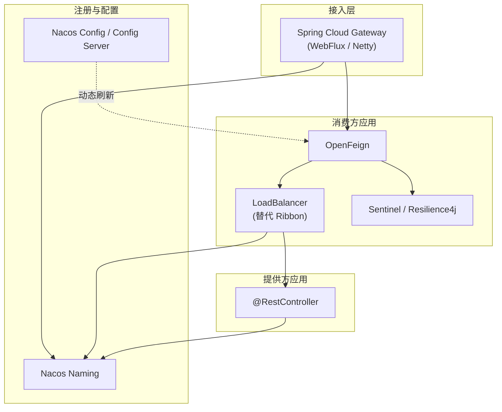
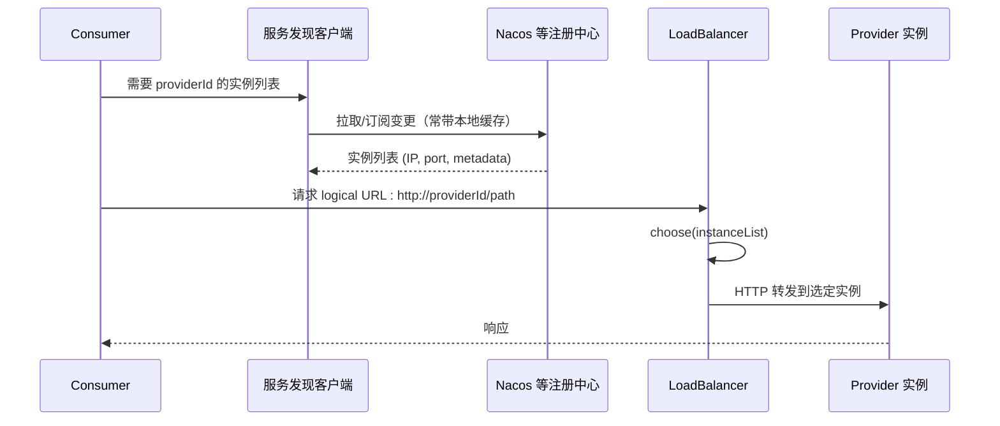
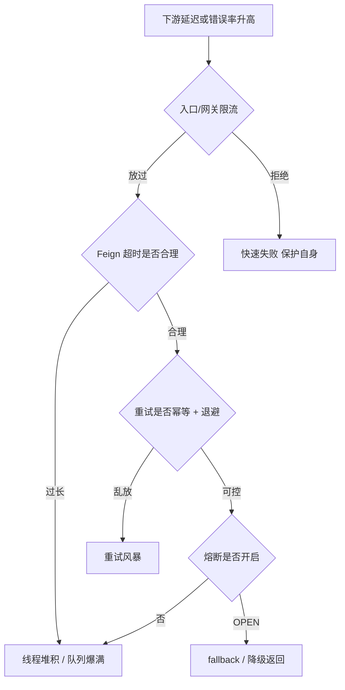
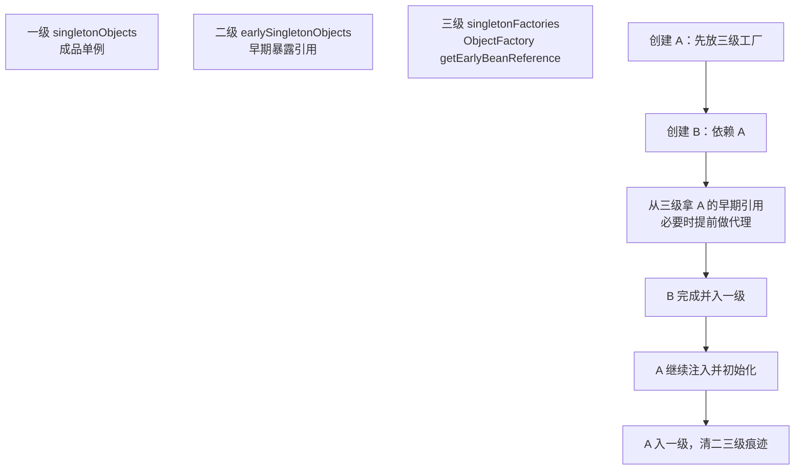
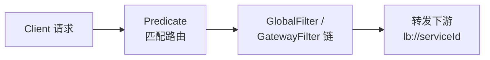
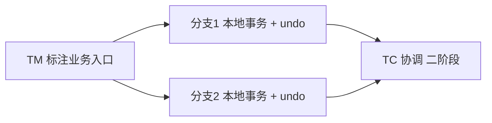
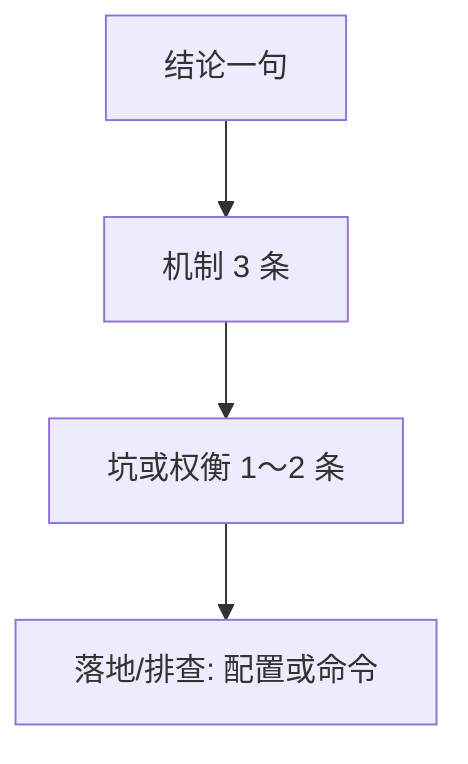

# Spring · Spring Boot · Spring Cloud · Nacos 高频面试题（IoC · AOP · 自动配置 · Feign · LoadBalancer · 中间件）

> 面向 **Spring Framework 6.x + Spring Boot 3.x + Spring Cloud 2023.x / 2024.x** + **Spring Cloud Alibaba（Nacos、Sentinel、Seata 等）**（**Jakarta**；**Boot 3 最低 JDK 17**，**虚拟线程** 等随 **JDK 21+**）。正文含 **`## 零`**：**联网面经归纳 + Mermaid 图**；**`## 十五`**：**背诵版 × 追问深挖版** 双栏速记 + **题号—章节检索表**；各章对 **IoC、事务、自动配置、网关、Feign/Ribbon、链路** 等做了 **表格 + 图解** 展开。版本以 **[Supported Versions](https://github.com/spring-projects/spring-boot/wiki/Supported-Versions)**、[Alibaba Release](https://github.com/alibaba/spring-cloud-alibaba/wiki) 与项目 BOM 为准。

---

## 目录

0. [面经检索说明与体系图谱](#零面经检索说明与体系图谱)
1. [Spring 核心：IoC 与 Bean](#一spring-核心ioc-与-bean)
2. [Spring MVC 与 Web](#二spring-mvc-与-web)
3. [AOP](#三aop)
4. [Spring Boot：启动与自动配置](#四spring-boot启动与自动配置)
5. [Spring Boot 3 与生态升级](#五spring-boot-3-与生态升级)
6. [Spring Cloud：体系与组件选型](#六spring-cloud体系与组件选型)
7. [Nacos 与 Spring Cloud Alibaba](#七nacos-与-spring-cloud-alibaba)
8. [服务调用、负载均衡与容错](#八服务调用负载均衡与容错)
9. [网关、安全与配置](#九网关安全与配置)
10. [可观测性、测试与部署](#十可观测性测试与部署)
11. [实战场景题](#十一实战场景题)
12. [面经高频补充](#十二面经高频补充)
13. [Feign · Ribbon/LoadBalancer · 客户端深化](#十三feign--ribbonloadbalancer--客户端深化)
14. [Seata · Sentinel · 消息与 Stream](#十四seata--sentinel--消息与-stream)（含 **题 73～75 · 五大组件与雪崩叙事**）
15. [背诵版 × 追问深挖版（速记表）](#十五背诵版--追问深挖版速记表)
16. [自测清单](#十六自测清单)

> **复习主线：** **IoC/DI → Bean 生命周期与循环依赖 → AOP 代理与自调用 → `@Transactional` 传播 → `AutoConfiguration.imports` → Nacos 注册/配置（`dataId`·`namespace`）→ OpenFeign + `spring-cloud-loadbalancer`（Ribbon 存量）→ Gateway + Sentinel/Resilience4j → MQ（RocketMQ/Kafka）→ Observation**。参考：<https://docs.spring.io/spring-boot/reference/>

---

## 零、面经检索说明与体系图谱

### 联网检索结论怎么用？

社区面经（腾讯云、阿里云开发者、掘金、CSDN、牛客、JavaGuide 等）里**高频重合**的考点大致是：**「Netflix 五件套」历史心智（Eureka / Ribbon / Hystrix / Feign / Zuul）→ 现状（Nacos、Spring Cloud LoadBalancer、Sentinel / Resilience4j、Gateway）**；**注册发现流程与缓存**；**Feign 超时、重试与懒加载**；**服务雪崩 = 超时 + 重试风暴 + 无熔断**；**分布式事务 Seata**；**链路从 Sleuth 迁到 Micrometer Observation + Tracing**。

**重要约束：** 面经里出现的 **具体数字**（例如 Nacos 心跳秒数、剔除超时）会随 **Server 版本与配置** 变化，**回答时优先说「机制」**，数位以 **当前项目所用的官方文档** 为准，避免死记过期参数。

### 推荐阅读（外链，注意文章日期与版本）

| 主题 | 参考链接 |
|------|----------|
| Spring Cloud 面试题汇总（春招向） | [阿里云开发者社区 · 2025 春招 Spring Cloud 面试题汇总](https://developer.aliyun.com/article/1651028) |
| 组件、雪崩、熔断与 Nacos/Eureka 对比 | [腾讯云开发者社区 · Spring Cloud 常见面试题](https://cloud.tencent.com/developer/article/2442037) |
| Spring / Spring Boot 体系问答 | [JavaGuide · Spring 常见面试题](https://interview.javaguide.cn/system-design/spring.html) |
| Nacos + Feign + Gateway 实战串联 | [掘金 · Spring Cloud Alibaba 教程向长文](https://juejin.cn/post/7538441683136806927) |
| Netflix 组件面试题（存量项目仍可能被问） | [百度云 · Gateway/Eureka/Ribbon/Hystrix/Feign](https://cloud.baidu.com/article/2818477) |

### 图解：微服务典型拓扑（注册中心 + 网关 + Feign）



### 图解：一次「解析服务名 → 选实例 → 调用」的顺序（概念）



### 图解：服务雪崩与常见防线（面经爱考「组合拳」）



---

## 一、Spring 核心：IoC 与 Bean

### Spring 生态在技术栈里的位置？（开胃）

**答：** **Spring Framework**：**IoC 容器 + AOP + 声明式事务 + Web（MVC/WebFlux）+ 集成测试**。**Spring Boot**：**约定优于配置 + 自动装配 + 内嵌服务器 + Actuator**。**Spring Cloud**：**注册配置、路由、负载均衡、熔断、链路**（**release train / BOM 必须对齐**）。**Boot 3**：**`javax.*` → `jakarta.*`**。

---

### 1. IoC 与 DI 是什么？和「工厂模式」差在哪？

**答：** **IoC（控制反转）**：对象的生命周期与依赖关系由 **容器** 管理，业务类不自己 `new` 依赖。**DI（依赖注入）** 是实现 IoC 的主要手段：构造器注入、setter 注入、字段注入（不推荐在核心业务域滥用）。  
与手写工厂相比：**容器** 负责 **作用域、生命周期回调、循环依赖处理（有限场景）、AOP 代理** 等横切能力；工厂偏 **显式创建**，Spring 偏 **声明式装配 + 约定**。

---

### 2. `@Component`、`@Service`、`@Repository`、`@Controller` 区别？

**答：** **都是 stereotype**，最终都会注册为 Bean；差异主要在 **语义分层** 与 **少量附加行为**：  
- **`@Repository`**：数据访问层语义，**历史上** 与持久化异常 **`PersistenceExceptionTranslation`（将底层异常转为 `DataAccessException`）** 相关。  
- **`@Service`**：业务层语义。  
- **`@Controller` / `@RestController`**：Web 层；`@RestController` = `@Controller` + `@ResponseBody`。  
**面试收束：** 分层可读性 + AOP/异常翻译等 **边缘增强**，**不要** 过度迷信「换注解就能改行为」。

---

### 3. Bean 作用域有哪些？单例 Bean 线程安全吗？

**答：** 常用 **`singleton`（默认）**、`prototype`、`request`、`session`、`application`（Servlet）、`websocket` 等。  
**单例 Bean 本身不等于线程安全**：若 Bean **无可变共享状态**（仅依赖无状态 DAO），则安全；若 **有成员变量缓存** 等，需 **`prototype`** 或 **加锁/ThreadLocal（慎用）** / 把可变状态下沉到 **方法局部**。**原型作用域** 的 Bean 若被 **单例 Bean 注入**，需注意 **lookup 方法注入** 或 **`ObjectProvider`** 每次获取新实例。

---

### 4. Bean 生命周期关键节点口头描述？

**答：** 典型链路（概念顺序）：**实例化 → 属性注入 → `BeanNameAware` / `BeanFactoryAware` 等 aware → `BeanPostProcessor.postProcessBeforeInitialization` → `@PostConstruct` / `InitializingBean.afterPropertiesSet` / 自定义 init → `postProcessAfterInitialization` → Bean 可用 → 容器关闭时 `@PreDestroy` / `DisposableBean.destroy`。  
**追问点：** AOP 代理往往在 **后置处理器** 阶段包装 **目标 Bean**，因此 **同类内自调用** 不走代理（面试常考）。

**【图解 · 单例 Bean 初始化主路径】**（与面经「四阶段」说法对应：**定义 → 实例化 → 初始化含代理 → 销毁**）

```mermaid
flowchart LR
  BD[BeanDefinition 解析]
  INST[实例化构造器]
  DI[属性注入 / Aware]
  BPP1[BeanPostProcessor\nbefore init]
  INIT[@PostConstruct /\nInitializingBean]
  BPP2[BeanPostProcessor\nafter init\n含 AOP 代理包装]
  USE[就绪使用]
  DEST[销毁钩子]
  BD --> INST --> DI --> BPP1 --> INIT --> BPP2 --> USE
  USE --> DEST
```

**面经补充 · `BeanFactory` vs `ApplicationContext`：** 几乎所有 Spring 面试集锦都会放到一起问，可按下表收束（**开发默认选 `ApplicationContext`**）。

| 维度 | `BeanFactory` | `ApplicationContext` |
|------|----------------|----------------------|
| 定位 | IoC **最小编程模型** | 企业级 **完整容器**，**继承** `BeanFactory` |
| 单例 Bean 创建时机 | **懒加载** 倾向更明显（概念层面常这样说） | **容器 refresh 时** 预实例化**非懒**单例更常见 |
| 能力 | `getBean`、基础生命周期 | **事件发布**、`MessageSource`、**资源加载**、`Environment` 等 |
| 典型实现心智 | 入门 / 框架内部 | `ClassPathXmlApplicationContext`、**`AnnotationConfigApplicationContext`**、`SpringApplication` 创建的 Web 容器 |

---

### 5. 循环依赖如何解决？为什么构造器注入环不行？

**答：** **默认可行的单例 + setter/字段注入** 场景，Spring 用 **三级缓存**（singletonObjects / earlySingletonObjects / singletonFactories）提前暴露 **早期引用**，再完成属性填充。**构造器循环依赖** 无法在创建前暴露实例 → **通常直接失败**（可用 `@Lazy` 打破、或重构层次）。**`prototype`** 循环依赖 **不支持**。**面试警示：** 循环依赖是 **设计味道**，能重构优先重构。

**【图解 · 三级缓存如何打破 setter/字段循环】**（口头需能指认：**一级成品池 / 二级早期对象 / 三级工厂**，以及 **AOP 代理要提前掺入时为什么需要 ObjectFactory**）



**展开说清（避免一句话）：**  
1. **setter/字段**：对象可以先 **`new` 出来**，再慢慢补依赖，所以 **允许先塞一个「尚未填完属性的引用」**。  
2. **构造器**：必须 **一次性凑齐参数**，两个类互相在构造器里要对方 → **任何一方都无法先完整诞生** → **容器直接报环**。  
3. **三级缓存的深层考点**：若提前暴露时要套 **AOP 代理**，需通过 **`getEarlyBeanReference`** 一类机制 **把「以后要注入的引用」就定成代理**，否则后面注入的仍是原生对象，**代理链路断裂**（面经里爱与「`@Async` / `@Transactional` 自调用失败」对比着问）。

---

### 6. `@Autowired` 注入规则？与 `@Resource`、`@Inject`？

**答：** **`@Autowired`**：默认 **按类型**，多实现时配合 **`@Primary`** / **`@Qualifier`** / **`@Order`**（集合注入顺序）。**`@Resource`（JSR-250）**：默认 **按名称** 再按类型。`@Inject`（JSR-330）+ `@Named` 类似 Guice 风格。  
**推荐：** **构造器注入** 便于 **不可变依赖** 与 **单元测试**。

---

### 7. `FactoryBean` 与 `BeanFactory`？

**答：** **`BeanFactory`**：IoC **容器根接口**（`getBean` 等）。**`FactoryBean`**：一种 **工厂 Bean**，`getObject()` 才是真正的 Bean；用于 **创建复杂对象**（如 MyBatis `MapperFactoryBean`）。`&` 前缀可拿 **FactoryBean 自身**。

---

## 二、Spring MVC 与 Web

### 8. `DispatcherServlet` 处理请求的大致流程？

**答：** **请求 → `DispatcherServlet` → `HandlerMapping` 找处理器（Controller 方法）→ `HandlerAdapter` 执行 → 参数解析（`HttpMessageConverter` 等）→ 调用方法 → 返回值处理（`ViewResolver` 或消息转换）→ 响应**。  
**异常：** `@ControllerAdvice` **全局异常处理** 拦截。  
**REST：** `@RestController` 少走视图解析，直接序列化 JSON。

**【图解 · Spring MVC 主链（面经默画版）】**

```mermaid
flowchart LR
  REQ[HTTP 请求]
  DS[DispatcherServlet]
  HM[HandlerMapping]
  HA[HandlerAdapter]
  HV[Controller 方法]
  RES[返回值处理\nJSON/View]
  REQ --> DS --> HM
  HM --> HA --> HV --> RES
  ERR[@ControllerAdvice] -. 异常 .-> RES
```

---

### 9. Spring MVC 常用注解？

**答：** `@RequestMapping` 及其派生（`@GetMapping` 等）、**`@RequestParam` / `@PathVariable` / `@RequestBody` / `@RequestHeader`**、`@Valid` + Bean Validation、`@ResponseStatus` 等。**内容协商** 与 **`produces/consumes`** 控制 MIME。

---

### 10. 拦截器 `HandlerInterceptor` 与过滤器 `Filter` 区别？

**答：** **Filter** 在 **Servlet 容器** 层，**先于** DispatcherServlet；能做 **编码、跨域、鉴权前置** 等。**Interceptor** 在 **Spring MVC** 内，**能拿到 Handler 信息**，更贴近业务（登录态、审计、细粒度鉴权）。**执行顺序：** Filter chain → DispatcherServlet → Interceptor `preHandle` → Controller → `postHandle` → `afterCompletion`。

---

## 三、AOP

### 11. AOP 核心概念？

**答：** **切面（Aspect）**、**连接点（JoinPoint）**、**切点（Pointcut）**、**通知（Advice：前置/后置/环绕/异常/最终）**、**织入（Weaving）**。Spring 默认 **运行时动态代理**：**接口** 用 **JDK Proxy**，**无接口** 用 **CGLIB**（子类代理）。**同类自调用** 不走代理 → **环绕/事务** 可能失效。

---

### 12. `@Transactional` 不生效常见原因？

**答：** **非 public**、**自调用**、**异常类型不匹配**（默认只回滚 Runtime/Error，受检异常需 `rollbackFor`）、**数据库引擎不支持**（如 MyISAM）、**多数据源未配 TM**、**只读事务与传播行为误用**、**未被 Spring 管理** 的 Bean、**异步线程** 中事务上下文丢失等。

**【表 · 面经高频「失效场景」拆解】**（答的时候挑 **2～3 个** 展开因果即可，不必默背整表）

| 现象 / 场景 | 为何失效或未按预期回滚 | 怎么改或怎么验证 |
|-------------|------------------------|------------------|
| 同类 `this.method()` 调 `@Transactional` 方法 | **自调用** 不走过代理 | 拆类、`ApplicationContext` 取代理、`@Async` 拆线程等 |
| `private` / `protected` 上的声明式事务 | Spring AOP **默认不代理非 public** | 改 **public**（设计上是否应该事务另说） |
| `try { ... } catch (Exception e) { 吃掉了 }` | **未再抛出**，事务拦截器 **看不到异常** | 记录日志后 **`throw`** 或 **`TransactionAspectSupport`** 手动回滚 |
| 受检异常业务直接上抛 | 默认 **rollbackFor 不含** checked | 配置 **`rollbackFor = Exception.class`** |
| 新开线程 / `@Async` 里跑 DB | **ThreadLocal 事务同步** 过不去 | **事务边界放在主线程** 或 **编程式事务 / 分布式事务** |
| 注入的是 **new 出来的** Service | **不是 Spring Bean** | 交给容器管；工厂返回的要是代理 |
| 多数据源都标 `@Transactional` | **没指定** `transactionManager` | **`value`/`transactionManager`** 指到正确 TM |

**【图解 · 声明式事务「必须得进代理」】**


---

### 13. 事务传播行为 `PROPAGATION_*` 如何背？

**答：** 记 **最常用 3 个**：  
- **`REQUIRED`（默认）**：有则加入，无则新建。  
- **`REQUIRES_NEW`**：挂起当前，**新建独立事务**（审计、日志隔离）。  
- **`NESTED`**：**嵌套回滚点**（底层依赖 **保存点/JDBC**），与 `REQUIRES_NEW` 区别常被追问。  
其余 `SUPPORTS`、`NOT_SUPPORTED`、`MANDATORY`、`NEVER` 按语义记「要不要事务、有没有就抛错」。

---

### 14. 事务隔离级别与应用侧选择？

**答：** `READ_UNCOMMITTED` / `READ_COMMITTED` / `REPEATABLE_READ` / `SERIALIZABLE`。  
**MySQL InnoDB** 默认 **RR**（注：幻读在 InnoDB 下用 **GAP Lock** 等缓解，语义细节可深问）。  
**面经答法：** **读已提交** 更贴近很多 OLTP；**可重复读** 适合 **报表一致性读**；**串行化** 少见。**应用层** 仍需 **乐观锁 / 唯一约束** 处理并发更新。

---

## 四、Spring Boot：启动与自动配置

### 15. `SpringApplication.run` 做了什么（High level）？

**答：** 创建 **`ApplicationContext`**、刷新容器 **装载 Bean**、触发 **`ApplicationRunner`/`CommandLineRunner`**、启动 **嵌入式 Web 容器**（如 Tomcat on the classpath）、注册 **shutdown hook**。**外部化配置**、**日志系统** 初始化也在启动链路中。

---

### 16. 自动配置原理：`@SpringBootApplication` 里有什么？

**答：** 复合注解：**`@SpringBootConfiguration`**（本质 `@Configuration`）、**`@EnableAutoConfiguration`**、**`@ComponentScan`**。  
**`EnableAutoConfiguration`** 通过 **`META-INF/spring/org.springframework.boot.autoconfigure.AutoConfiguration.imports`**（Boot 3 起）或旧版 **`spring.factories`**（迁移期仍可能被提及）加载 **自动配置类**。配合 **`@ConditionalOnClass` / `@ConditionalOnMissingBean`** 等 **条件注解** 实现 **按需装配**。

**【图解 · 自动配置「谁决定装不装」】**（面经追问：`@ConditionalOn*` 家族、`imports` 文件放哪、为何还要 `spring.factories` 口播）

```mermaid
flowchart TD
  RUN[Spring Boot 启动]
  IMP[读取 AutoConfiguration.imports]
  EACH[遍历每个 AutoConfiguration 类]
  C{@ConditionalOnClass / MissingBean ...}
  NO[跳过]
  YES[注册条件满足的 @Bean]
  RUN --> IMP --> EACH --> C
  C -->|不满足| NO
  C -->|满足| YES
```

---

### 17. `application.yml` 优先级、profile、多环境如何组织？

**答：** **配置优先级** 以官方文档为准（**命令行 > 环境变量 > jar 外置 > jar 内** 等，版本间有微调）。**`spring.profiles.active`** 激活 **dev/test/prod**；**`spring.config.import`** 引入 **Nacos/Consul** 等。**敏感信息** 倾向 **环境变量/密钥服务**，避免入库 Git。

---

### 18. Starter 的作用？自己写一个 Starter 要点？

**答：** **依赖聚合 + 自动配置**，开箱即用。**自定义：** `autoconfigure` 模块 + `META-INF` 里注册 AutoConfiguration + **完善的条件注解** + **配置属性 `@ConfigurationProperties`（推荐开启 `spring-boot-configuration-processor`）**。

---

## 五、Spring Boot 3 与生态升级

### 19. Spring Boot 3 / Spring 6 必提的三件事？

**答：**  
1. **`javax.*` → `jakarta.*`**（Tomcat、JPA、Servlet API 等全迁）。  
2. **最低 JDK 17**（生态对齐现代语言特性）。  
3. **观测：** **Micrometer / Micrometer Tracing** 取代旧 Sleuth 心智（具体 starter 以 BOM 为准）。

---

### 20. AOT 与 Native Image 在面试里怎么说？

**答：** **AOT（提前处理）**：构建期生成 **可预测的 Bean 元数据与反射提示**，减少启动时类扫描与配置解析，为 **GraalVM Native Image** 铺路。**Native Image**：**更快的启动与更小内存**，代价是 **构建慢、反射/动态代理需额外配置**、部分库 **兼容性** 需验证。**适用：** Serverless、CLI、边缘；**传统长运行 JVM** 仍常见。

---

### 21. 虚拟线程（Java 21）与 Spring Boot 如何配合？

**答：** **Tomcat/Undertow** 等可配置 **虚拟线程执行请求**，利点：**阻塞式代码**（JDBC、HTTP 客户端）在高并发下 **显著降低 OS 线程压力**。注意：**pinning**（在 `synchronized` 内阻塞 I/O）会削弱收益；**用 `ReentrantLock` 或重构**。**不要** 把虚拟线程当作「万能卡」，CPU 密集仍要靠 **算法与并行框架**。

---

## 六、Spring Cloud：体系与组件选型

### 22. Spring Cloud 与 Spring Boot 关系？

**答：** **Spring Boot** 是 **应用快速构造** 的基础；**Spring Cloud** 在 Boot 之上提供 **分布式系统的「一等公民」能力**（注册发现、配置、路由、熔断、链路、契约等），**版本需对齐 BOM（release train）**，避免 ** starters 混搭地狱**。

---

### 23. Nacos、Eureka、Consul 怎么对比（面试简版）？

**答：**  
- **Eureka（Netflix，维护热度下降）**：经典 AP 模型、**自助保护**、**客户端缓存**，**配置中心** 需另配。  
- **Consul**：**CP 强一致** 可选、**服务网格周边**、多数据中心；**健康检查**丰富。  
- **Nacos（国内面经高频）**：**注册 + 配置** 一体、**AP/CP 可切换（Naming）**、控制台友好；需理解 **长连接推送、集群脑裂、配置灰度** 等运维题。  
**选型：** 存量 Spring Cloud Netflix 迁移；新项目常 **Nacos / K8s Service** 二选一或并存。

**【表 · Nacos vs Eureka · 面经扩展版】**（社区文章常考 **AP/CP、配置中心一体与否、推送模式**；**心跳与超时以运维配置与官方为准**）

| 对比项 | Nacos Naming | Eureka |
|--------|----------------|--------|
| CAP 取舍（口述层） | **默认可 AP**；**Naming 可切 CP**（与集群模式有关） | 经典 **AP**；**自我保护** 减轻雪崩式剔除 |
| 配置中心 | **同栈 Config** | **无**，常配 Spring Cloud Config |
| 数据更新心智 | **推送 + 拉取** 组合（长连接常见） | **周期性拉取 + 客户端缓存** 心智 |
| 运维/UI | **控制台、namespace 隔离** 面经常提 | UI **相对简单** |
| 生态态势 | **国内项目极常见** | **维护态**，多在老项目追问 |

**【收束句】**：**Eureka = AP + 自我保护 + 本地缓存**；**Nacos = 注册配置一体 + AP/CP 切换 + 运维面**；**Consul = 健康检查 + 多 DC + CP 取向好讲**。

---

### 24. Spring Cloud Config vs Nacos / Apollo？

**答：** **Config Server + Git**：**版本化、审计、回滚** 强；**实时推送** 能力弱，多需 **Bus（逐渐淡出心智）** 或 **Webhook**。**Nacos/Apollo**：**秒级推送、灰度、权限、审计 UI**；**缺点** 是需 **自建高可用集群**。**K8s** 场景也可能 **ConfigMap + Secret** 为主。

---

## 七、Nacos 与 Spring Cloud Alibaba

### 43. Nacos 在 Spring 技术栈里是什么角色？

**答：** **[Nacos](https://nacos.io/)**：**动态服务发现 + 动态配置 + 元数据管理**（控制台）。在 **Spring Cloud Alibaba** 里常 **一站式替代 Eureka + Config**，与 **Spring Boot** 通过 **`spring-cloud-starter-alibaba-nacos-discovery` / `...-nacos-config`** 集成。**Naming** 管 **实例注册、健康、负载均衡上游列表**；**Config** 管 **远端 KV、多环境、监听与推送**（可与 **K8s**、**多集群**并存）。

---

### 44. `dataId`、`group`、`namespace` 怎么用来切环境？

**答：**  
- **`dataId`**：某一份配置的逻辑文件名（常为 **`${spring.application.name}.${file-extension}`** 或 **`service-name-prod.yaml`**）。  
- **`group`**：业务分组（默认可用 **`DEFAULT_GROUP`**，多租户时常按 **业务线/系统** 分）。  
- **`namespace`**：**环境/租户隔离**（dev/test/prod 各一 **namespaceId**），避免 **误读配置**。**客户端** 必须 **与服务发现同一套 server 地址 + namespace** 心智一致。  
**追问：** **共享配置** 用 **`shared-configs` / `extension-configs`**（或等价属性）拉取 **多 `dataId`**，注意 **优先级与覆盖顺序**（以 **官方与当前 starter 文档** 为准）。

---

### 45. Boot 里 Nacos **注册发现** 要讲得清什么？

**答：** **`spring.cloud.nacos.discovery`**：**服务名**（常为 **`spring.application.name`**）、**namespace/cluster**。实例默认 **临时（ephemeral）**：靠 **心跳** 维持，**/下线超时剔除**；**持久实例** 适合 **特殊健康检查模型**（面经少抠实现细节，能说 **场景差异** 即可）。**元数据 `metadata`** 可挂 **版本、灰度标签**，供 **Gateway Predicate / LoadBalancer** 做路由（与 **题 30** 联动）。**跨网段** 注意 **注册的 IP**（`ip`、`network-interface`、`prefer-ip-address` 等）避免 **消费者连不上**。

---

### 46. Nacos **配置中心** 与 Boot 拉取配置的常见方式？

**答：** **Boot 2.4+** 心智：**`spring.config.import`** 引入 **`nacos:`**（或 **`optional:nacos:`** 允许 Nacos 不可用时启动，**谨慎用于生产默认**）。旧 **`bootstrap.yml` + `spring-cloud-starter-bootstrap`** 仍可见于存量项目。**长连接监听** 推送变更；本地 **`failover`/snapshot** 在 **Server 不可达** 时兜底（运维题：磁盘缓存与启动行为）。**加密配置** 需结合 **Nacos 插件/自建 KMS**，面试可说 **不落盘明文、权限到 namespace/group**。

---

### 47. Nacos Naming **AP / CP** 在面试里怎么说？

**答：** **AP 模式**：可用性优先，**分区下仍可注册发现**（**可能短暂不一致**）。**CP 模式**（**Raft 选主相关**）：**强一致读写路径**，**分区或集群异常时可用性下降**。选型：**注册发现默认多倾向 AP**；需要 **强一致配置/选主类场景** 再评估 CP 与集群规模。**忌背口号**：结合 **CAP 在分区时的取舍** 与 **实际故障域**（单 AZ / 多活）说。

---

### 48. Nacos **集群与高可用**、常见踩坑？

**答：** 多节点 **外置 DB（Derby 仅单机教学）**、**区分内网集群间端口与控制台**。**脑裂/不可达**：思考 **客户端重试、本地缓存、是否乱杀实例**。**配置推送风暴**：**大文件、高频变更** 要 **分批、合并**。**升级**：对齐 **Server 与 client / Spring Cloud Alibaba** 的 **兼容性表**。与 **题 37（动态刷新）**、**题 23（与 Eureka/Consul 对比）** 一并串答。

---

## 八、服务调用、负载均衡与容错

### 25. OpenFeign 是什么？为何优于裸 `RestTemplate`？

**答：** **声明式 HTTP 客户端**：接口 + 注解映射路由、参数、Header。**集成 LoadBalancer** 做 **服务发现后的负载均衡**。优点：**类型安全、可读性、统一拦截器（重试、日志、传递 Trace）**。**注意：** **超时、重试、幂等** 要成体系配置，避免 **雪崩式重试**。

---

### 26. 负载均衡：`@LoadBalanced` 背后机制？

**答：** Spring Cloud **客户端负载均衡**：从注册中心取 **实例列表**，**过滤器** 选择 **一个实例** 发起请求。**Ribbon（老）** 已被 **`spring-cloud-loadbalancer`** 取代为默认心智。

**【面经 · Ribbon 常见算法（老项目口播）】** 社区题单常列：**轮询 `RoundRobin`**、**随机 `Random`**、**响应时间加权 `WeightedResponseTime`**、**区域亲和 `ZoneAvoidanceRule`**、**可用性过滤 `AvailabilityFilteringRule`**。**新项目** 转向 **`ReactorLoadBalancer` 自定义** 或 **Nacos/注册中心权重 + 元数据路由**，不要只背类名不说场景。

**【面经 · Feign / Ribbon 首次调用慢】** 旧栈常见原因：**懒加载**（第一次调用才初始化客户端和连接池、拉全量实例），表现为 **首个请求 RT 飙高**。排查/缓解：**预热**（启动后主动跑一次健康检查调用）、**连接池与超时配好**、**新版 LoadBalancer + 合理 cache TTL**。回答时强调 **「已观察过 Arthas/指标」** 比背参数分高。

---

### 27. 熔断、限流、降级：Hystrix 凉了用什么？

**答：** **Hystrix 维护模式**。**Resilience4j**、**Sentinel** 为面经常客：**Resilience4j** 贴合 Spring/Reactive、函数式；**Sentinel** **控制台、热点参数限流、集群限流**强。要讲清：**熔断**（错误率/慢调用）、**舱壁**、**超时**、**重试+抖动**、**降级返回** 的组合。

---

### 28. 重试与幂等如何和服务间调用一起设计？

**答：** **GET/查询** 可适度重试；**POST 下单** 等非幂等需 **业务幂等键（Idempotency-Key）**、**Token 表** 或 **数据库唯一约束**。**重试** 配 **指数退避 + 最大次数**；与 **熔断** 联动避免 **重试风暴**。

---

### 49. Ribbon 与 `spring-cloud-loadbalancer` 区别？存量项目迁移怎么说？

**答：** **Ribbon（Netflix）**：老牌 **客户端负载均衡** + 与 **旧 Feign / RestTemplate** 深度绑定；**已进入维护**，新 BOM 默认 **LoadBalancer**。**`spring-cloud-loadbalancer`**：**Spring 官方** 实现，**响应式友好**，与 **`BlockingLoadBalancerClient` / `ReactiveLoadBalancer`** 配合。**迁移：** 去掉 **`spring-cloud-starter-netflix-ribbon`**，保留 **`spring-cloud-starter-loadbalancer`**；检查 **自定义 `IRule`** → 改为 **`ReactorServiceInstanceLoadBalancer` / `ServiceInstanceListSupplier`**；配置项 **前缀与类名全变**，需按版本 **对照迁移文档**。**面经：** 能说清 **「Ribbon 退环境 + LoadBalancer 是默认」** 即可加分。

---

### 50. `@LoadBalanced RestTemplate` / `WebClient.Builder` 与 Feign 怎么选型？

**答：** **`RestTemplate`**：**Spring 6.1+ 起标为弃用**，新代码优先 **REST 客户端抽象** 或 **WebClient / OpenFeign**。**`@LoadBalanced`**：在请求里把 **`http://service-id/path`** 交给 **LoadBalancer** 解析为真实 host。**`WebClient`**：配合 **`@LoadBalanced WebClient.Builder`** 做 **响应式** 调用。**OpenFeign**：**声明式**、适合 **大量 HTTP API**。**选型：** 简单同步补丁可 **RestTemplate**（ legacy ）；**非阻塞** 用 **WebClient**；**接口多、要统一拦截器** 用 **Feign**。

---

### 51. OpenFeign 注解与设计要点？

**答：** **`@FeignClient(name/value, path, url, contextId)`**：**`name`** 为 **注册中心服务名**；**`url`** 写死则 **不走发现**（适合 **单机联调、测试替身**）；**`contextId`** 解决 **同服务多 Feign 接口 Bean 名冲突**。**方法上：** `@GetMapping` / `@PostMapping`、`@RequestParam` / `@PathVariable` / `@RequestBody` / `@RequestHeader`。**注意：****GET + `@RequestBody`** 部分服务端 **不兼容**；**Map 作查询参数** 需 **`SpringQueryMap`**。**`configuration`** 可配 **自定义 Encoder/Decoder/Contract**。

---

### 52. Feign 超时、重试与「谁包谁」？

**答：** 默认 **底层 HTTP 客户端**（JDK `HttpURLConnection` 或 **OkHttp** 等）各自有 **connect/read timeout**；Feign 还有 **`Request.Options`**。**Spring Cloud OpenFeign** 常用 **`spring.cloud.openfeign.client.config`** 按 **default 或服务名** 分层配置。**重试：** Feign 自带 **`Retryer`**（默认策略要谨慎理解）；与 **Spring Retry / Resilience4j / Sentinel** 叠加时须避免 **重复重试放大故障**。**面经口径：** **超时 < 熔断阈值**、**重试仅幂等**、**指数退避 + 上限**。

---

### 53. `RequestInterceptor` 与上下文传递（Trace / 灰度 / 用户信息）？

**答：** 在 **发出请求前** 统一 **加 Header**（如 **`Authorization`**、**灰度标签**、**traceparent**）。注意：**Hystrix 隔离线程** 时代曾丢 **ThreadLocal**；现代 **Sentinel/Feign** 仍要确认 **异步线程** 是否 **手动传 MDC/上下文**。**Micrometer Observation**：优先 **官方传播机制** 而非手写 ThreadLocal。

---

### 54. Feign **fallback / fallbackFactory** 与异常？

**答：** **`fallback`**：**失败时兜底实现类**（需作为 **Spring Bean**）。**`fallbackFactory`** 可拿到 **`Throwable`**，便于 **日志与分类降级**。**注意：** **超时 / 5xx / 熔断** 都会进 fallback 路径的 **心智**；与 **`ErrorDecoder`** 配合可把 **部分 4xx** 转为业务异常 **不进** fallback。**面经：** 区别 **「业务校验失败」与「依赖不可用」** 的返回形态。

---

### 55. `LoadBalancer` **自定义路由**（灰度、同单元优先）怎么说？

**答：** 实现 **`ReactorServiceInstanceLoadBalancer`**（或旧栈对应扩展点），注入 **`ServiceInstanceListSupplier`**，在 **`choose`** 中按 **`metadata`、Nacos 集群名、权重、金丝雀标** 过滤。**要点：** 与 **注册中心写入的元数据**、**网关下发的 Header** **约定一致**；**无可用实例** 时的 **回退策略**（全量实例 vs 报错）要说清。

---

### 56. Feign 与 **Resilience4j / Sentinel** 集成层次？

**答：** **Feign** 负责 **HTTP 编解码**；**熔断限流** 常在 **Feign 外包围**（**切面 / Filter / Sentinel 资源名**）。**Sentinel**：**控制台动态规则**、**热点参数**、**系统自适应**；**Resilience4j**：**与 Boot 配置绑定**、**函数式**。**不要** 叠过多层 **重试+熔断+超时** 导致 **行为不可预测**——**画一张调用栈图** 面试更稳。

---

### 57. **OkHttp / HttpClient** 作为 Feign 客户端要注意什么？

**答：** 引入 **`feign-okhttp` 或 `feign-hc5`** 等，开启连接池、合理 **最大空闲连接** 与 **保活**，与 **下游 QPS** 匹配。**HTTPS** 校验证书、**超时与 Dispatcher** 线程数。**面经：** 「Feign **换客户端** 是为了 **连接复用 + 更可控超时**」。

---

### 58. **`spring-cloud-starter-openfeign` 与 Boot 3 / 模块化 JVM**？

**答：** Boot 均为 **Jakarta**；**依赖对齐 BOM**，避免 **混用旧 Feign 与 新 LoadBalancer**。**Native Image** 若用 Feign：**反射与动态代理** 可能需 **额外 hint**（按 GraalVM 文档与社区样例验证）。

---

## 九、网关、安全与配置

### 29. Gateway 与 Zuul 1.x 差异？

**答：** **Zuul 1**：Servlet **阻塞** 模型。**Spring Cloud Gateway**：**WebFlux（Netty）+ Route + Predicate + Filter**，**非阻塞** 在高并发下更有优势。**生产** 网关还要谈 **TLS 终结、WAF、Auth、限流、灰度路由**。

**【图解 · Gateway 一次请求经过什么】**（Predicate 决定是否命中路由；Filter 链 **前置 / 后置**，可改请求头、鉴权、限流）



**对比收束（多说两句防追问）：** **Zuul1 = Tomcat 线程阻塞等 I/O**；**Gateway = Netty 事件循环 + 少量 worker**；**Zuul2** 虽异步，但 **Spring 官方叙事与示例仍以 Gateway 为主**。

---

### 30. 网关层如何做灰度？

**答：** **基于 Header/Tag**（如 `version=canary`）**Predicate** 路由到 **灰度实例**；或 **注册中心元数据权重**；**配置中心动态下发** 路由表。**关键：** **链路标志透传**（Feign 拦截器、MQ Header），避免 **后端仍走默认负载**。

---

### 31. Spring Security / OAuth2 / JWT 微服务里常见链路？

**答：** **网关验签**（JWT）+ **细粒度授权在后端**；或 **Opaque Token + introspection**。**资源服务器** 校验 **scope/role**。**注意：** **时钟偏移、密钥轮换、Token 黑名单（或短 TTL + refresh）**。

---

## 十、可观测性、测试与部署

### 32. 链路追踪在 Boot 3 语境怎么说？

**答：** **Micrometer Observation + Tracing bridge**：生成 **Trace/Span**，导出 **OTLP/Jaeger/Zipkin**（依实现）。要会解释 **`traceId` 在日志 MDC 的关联**、**跨线程传递**、**跨进程 Propagation**。

**【面经对比 · Sleuth 时代 vs Boot 3】** 老题：`spring-cloud-starter-sleuth` **埋点 + MDC**；新题：**`micrometer-tracing` + Brave/OTel 桥接**，与 **Observation API** 统一，**Feign/Web/WebFlux** 自动参与 span。**答：** **心智从「Sleuth Bean」迁到「Observation + Propagator」**。

---

### 33. Actuator 暴露哪些信息？生产注意事项？

**答：** **健康检查、指标、环境、线程 dump、heapdump（慎用）** 等。**生产必须：** **最小暴露、鉴权、网络隔离**；**敏感端点禁公网**。**K8s** 结合 **Liveness/Readiness**。

---

### 34. 本地与集成测试常用手段？

**答：** **`@SpringBootTest` + Testcontainers（MySQL/Kafka）**、**WireMock** 模拟下游、**契约测试（Spring Cloud Contract）**。区分 **纯单测** 与 **切片测试**（`@WebMvcTest`、`@DataJpaTest`）。

---

## 十一、实战场景题

### 35. 超卖场景：Spring 事务 + 数据库行锁怎么讲？

**答：** **Service `@Transactional`** 内 **`UPDATE stock WHERE id=? AND stock>=n`**，看 **影响行数**；失败则 **回滚/业务异常**。**防重：** **订单幂等号**。**更大流量：** **缓存预热、分段库存、MQ 削峰、异步对账**；**分布式一致性** 见分布式事务专题。

---

### 36. 「慢接口拖垮线程池」如何排查与缓解？

**答：** **排查：** Arthas **profiler**、线程 dump、**指标（线程池队列长度）**、**Tracing 慢 span**。  
**缓解：** **超时熔断**、**隔离舱壁**、**异步化**、**缓存**、**限流**，前端 **降级文案**。

---

### 37. 配置动态刷新不生效？

**答：** **Scope**：`@RefreshScope` 对 **带 `@ConfigurationProperties` 的 Bean** 的心智；**同类 Bean 内部引用** 可能仍是 **旧代理**。**Nacos**：**dataId/group、命名空间** 是否一致；**监听器** 是否收到事件；**WebSocket 推送失败** 时 **是否回退轮询**。**深化：** 第七章 **题 44～46**（隔离模型与 `spring.config.import`）。

---

## 十二、面经高频补充

### 38. Spring 与 Spring Boot 最大区别一句话？

**答：** **Spring** 是 **全栈编程与配置模型**；**Spring Boot** 是 **约定 + 自动配置 + 内嵌服务器 + 生产级 starter** 的 **工程化加速器**。

---

### 39. Spring MVC 与 Spring WebFlux 怎么选？

**答：** **多数团队以 MVC 为主**（生态、调试、人员结构）。**WebFlux** 适合 **高并发 I/O、网关、流式**；**JDBC 阻塞** 生态在 **全链路非阻塞** 上要谨慎评估 **R2DBC** 等。

---

### 40. Feign 超时默认值不清会怎样？

**答：** **下游抖动** → **线程堆积** → **连锁故障**。必须明确 **connect/read timeout**、**重试条件**、**熔断阈值**，并与 **线程池大小** 匹配。

---

### 41. K8s 时代还要注册中心吗？

**答：** **集群内** 常用 **Service + DNS**；**跨集群、多语言、灰度元数据、配置中心一体** 时仍可能要 **Nacos/Consul**。**面试答法：** **按组织复杂度与治理需求** 折中，而非非黑即白。

---

### 42. Spring Cloud Alibaba 与 Netflix 组件对照？

**答：** 典型心智：**Nacos** ↔ Eureka + Config；**Sentinel** ↔ Hystrix（部分）；**Seata** 管分布式事务；**RocketMQ Spring** 做消息。**版本兼容性** 查 **Spring Cloud Alibaba release notes**。

---

### 59. 「只用 Feign 不调配置超时」面经复盘？

**答：** 默认 **偏长或不确定** → **阻塞线程**/虚拟线程 **pinning** 风险 → **级联阻塞**。**落地：** **显式 `connectTimeout`/`readTimeout`**，与 **Tomcat 线程池/舱壁** 一致；**压测** 验证。

---

### 60. 为什么面试官爱问 **Ribbon 的 `IRule`**？

**答：** 考 **客户端负载均衡演进**：旧项目 **RandomRule / WeightedResponseTimeRule**；新项目 **LoadBalancer + 自定义 `ReactorLoadBalancer`**。**答：** 旧知 + **迁移后扩展点** 各说一段，体现 **读过生产代码**。

---

### 61. **Zuul 2 / Gateway / 南北向网关**一句话？

**答：** **Zuul 2** Netty **异步**，但 **Spring 社区主线** 已是 **Cloud Gateway**。**南北向：** **K8s Ingress / 云 WAF** 常与 **Spring Gateway** **分层**：外圈 **TLS/WAF**，内圈 **路由鉴权限流**。

---

## 十三、Feign · Ribbon/LoadBalancer · 客户端深化

> 与 **第八章题 25～28、49～58** 交叉复习；此处收纳 **紧凑面经句** 与 **易混点**。

### 62. Feign 日志级别 `NONE / BASIC / FULL` 生产怎么用？

**答：** **生产默认 NONE 或 BASIC**；**FULL** 易 **泄露 PII/鉴权信息**、**撑爆磁盘**。**临时排障** 可 **动态调高**，结束 **立刻恢复**。**配合 TraceId** 比 **全量 body 日志** 更健康。

---

### 63. **同名服务多 Feign 接口** 必提 `contextId`？

**答：** 是。否则 **Bean 定义冲突** 或 **配置串台**。**例：** **`@FeignClient(name = "order", contextId = "orderQueryApi")`**。**面经：** 合并微服务后 **多模块共用同一 `name`** 时常踩。

---

### 64. **`@FeignClient(url = "...")` 压测打挂下游** 怎么说？

**答：** **直连 url** 绕过注册中心 **容灾与限流认知**；压测流量 **直接打到固定 IP**。**纠正：** 走 **服务名 + 限流 + 熔断**，或 **专用 mock 环境**。

---

### 65. **LoadBalancer `cache` / 实例刷新延迟**？

**答：** 客户端会 **缓存实例列表**（实现与版本相关），**上下线** 非绝对实时。**缩短 TTL**、**健康检查**、**注册中心推送** 协同。**面经：** 「发版后 **旧实例仍被调用几秒**」归因 **缓存 + 优雅下线**。

---

## 十四、Seata · Sentinel · 消息与 Stream

### 66. Seata 与 Spring：AT / TCC / SAGA 面试怎么说？

**答：** **Seata**：**全局事务协调**。**AT（默认）**：**自动生成前后镜像**，**异步提交/回滚**；**前提** 业务库需 **undo_log 表**。**TCC**：**Try-Confirm-Cancel**，**业务侵入大**、**幂等要求高**。**SAGA**：**长事务**、**状态机**。**Spring 集成：** `@GlobalTransactional`；**与本地 `@Transactional`** 边界要说清。**忌：** 把 Seata 当 **银弹**——**高并发短事务** 优先 **本地事务 + 最终一致（消息）**。

---

### 67. Sentinel **资源、规则、与 Spring Cloud Alibaba**？

**答：** **资源**：**埋点**（`@SentinelResource` 或 **URL/Servlet** 自动）。**规则**：**QPS 限流、并发线程、熔断降级、系统保护、热点参数**；来源 **控制台 Nacos 持久化** 或 **代码**。**网关层** 与 **Feign 层** 可 **分层限流**。**面经：** **集群限流 Token Server**、**冷启动 / 排队** 等 **能说一两个即够**。

---

### 68. **Hystrix 线程池隔离 vs Sentinel 并发线程数**？

**答：** **Hystrix** 典型 **每依赖一线程池**（**隔离强**、**开销大**）。**Sentinel** 常用 **信号量/并发** + **系统负载** 保护，**模式更灵活**。**迁移面经：** **别照搬池大小**，按 **压测** 配 **限流阈值**。

---

### 69. **RocketMQ** 与 Spring（`RocketMQTemplate` / Spring Cloud Stream）？

**答：** **RocketMQ**：**顺序、延时、事务消息**。**Spring Boot Starter**：**`RocketMQTemplate` 同步/异步发送**、**`@RocketMQMessageListener` 消费**。**事务消息** 与 **本地化事务** 配合（**半消息 + 回查**）。**Stream**：**binder 抽象** 换 **Kafka/RocketMQ** 需理解 **binding 与死信**。**面经：** **幂等消费**、**重试与最大次数**、**堆积告警**。

---

### 70. **Spring Kafka / 与 Stream** 选型一句？

**答：** **Kafka**：**日志型高吞吐**、**分区有序**。**`KafkaTemplate` + `@KafkaListener`** 更直接、可控；**Spring Cloud Stream** 适合 **binding 抽象**、**多中间件切换**、**统一错误通道**。面试时至少展开：**消费者 `ack` 模式**、**`seek` 与重试死信**、**业务幂等键（防重复消费）**，别停留在一句话。

---

### 71. **Spring Cloud Bus** 还问吗？

**答：** 频率 **下降**；**配置刷新广播** 心智常被 **Nacos 推送 + `@RefreshScope`** 替代。**若被问：** **与 Config Server、MQ 中转** 的关系，答 **「了解，新项目少见」** 亦可。

---

### 72. **Spring Cloud Contract** 价值？

**答：** **消费者驱动契约（CDC）**：**Provider 侧生成 stub**，**Consumer 侧用 WireMock 校验**，减少 **联调扯皮**。**与 Feign** 结合：**接口变更可测**。**面经：** **中小团队成本**，大团队 **收益高**。

---

### 73. 「Spring Cloud 五大组件」死记硬背怎么展开成 **有画面** 的回答？

**答：** 面试官要的不是名词，而是 **请求怎么走进来、怎么找到服务、怎么扛故障**。**推荐叙事顺序：**  
1. **注册发现**：实例 **注册 / 心跳 / 拉取或推送**（Nacos/Eureka）。  
2. **网关**：**南北向入口** 鉴权、路由、限流（Gateway）。  
3. **客户端负载均衡**：**本地选实例**（Ribbon 历史题 / LoadBalancer 现状）。  
4. **远程调用**：**声明式 HTTP**（Feign）。  
5. **容错**：**熔断降级限流**（Hystrix 历史题 / Sentinel、Resilience4j）。  
**加一句落地：** **Boot 负责单个服务跑得起来，Cloud 负责一群服务在分布式里可控。**

---

### 74. **服务雪崩** 在面经里如何 **分条背因果**？

**答：** **因果链** 写满白板：**下游慢** → **调用方线程/连接堆积** → **重试放大流量** → **更多实例被拖死** → **全链路超时**。**对策按层说：** **超时与舱壁**、**入口限流**、**熔断打开快速失败**、**降级返回**、**缓存与异步**、**注册中心与健康检查避免把流量打到死实例**。与 **「零、体系图谱」** 中的雪崩图 **配套默画**。

---

### 75. **分布式事务** 面经里 **`@GlobalTransactional` 与本地事务**怎么讲清楚边界？

**答：** **本地 `@Transactional`**：只管 **当前数据源 + 当前进程**。**`@GlobalTransactional`（Seata）**：**TM 开启全局事务**，**各 RM 分支上报**，**一阶段业务 SQL + undo_log**，**二阶段提交或回滚**。  
**常见坑口述：** **远程调用在 TM 方法里** 若 **吞异常** 可导致 **全局状态不一致**；**与 MQ 最终一致** 比 **强一致 AT** 更适合 **高并发订单**。**表：** AT 要 **undo_log**；TCC 要 **业务实现三阶段**；Saga 要 **状态机 / 补偿**。



---

## 十五、背诵版 × 追问深挖版（速记表）

> **用法建议：** 左列 **30～60 秒开口版**（先得分）；右列 **面试官自然延伸的坑**（防追死）。正式答题仍回跳 **第一～十四章** 展开细节与 **「零」** 中的图。

### 题号落在哪一章？（检索用）

| 题号段 | 章节 | 说明 |
|--------|------|------|
| 开胃、1～7 | 一、IoC 与 Bean | 含 BeanFactory 表、三级缓存图 |
| 8～10 | 二、MVC / Web | 含 DispatcherServlet 图 |
| 11～14 | 三、AOP / 事务 | 含失效表、代理简图 |
| 15～18 | 四、Boot 启动与自动配置 | 含条件装配图 |
| 19～21 | 五、Boot 3 / 虚拟线程 | |
| 22～24 | 六、Cloud 选型 | 含 Nacos/Eureka 表 |
| 43～48 | 七、Nacos / Alibaba | |
| 25～28、49～58 | 八、Feign / LB / 容错 | 含 Ribbon 算法与首调慢 |
| 29～31 | 九、网关 / 安全 | 含 Gateway Filter 图 |
| 32～34 | 十、可观测 / 测试 | 含 Sleuth→Micrometer |
| 35～37 | 十一、场景题 | |
| 38～61 | 十二、面经补充 | |
| 62～65 | 十三、Feign 深化 | |
| 66～75 | 十四、Seata / Sentinel / MQ / 叙事 | |

### Spring 核心（IoC · Bean · 循环依赖）

| 背诵版（短答） | 追问深挖版（接着问） |
|----------------|----------------------|
| **IoC**：容器管生命周期；**DI** 是实现手段。 | 与「自己 new」比：**谁** 处理作用域、循环依赖、AOP 代理？ |
| **默认单例**；线程安全看 **有无共享可变状态**。 | `prototype` 注入进 singleton：**为何仍是同一个依赖？** 怎么每次拿新实例？ |
| 生命周期：**实例化 → 注入 → BPP → init → BPP（**代理**）→ 销毁**。 | **`postProcessAfterInitialization` 才包代理** → **同类 `this` 自调用** 为何没事务？ |
| 循环依赖：**三级缓存** 提前暴露早期引用；**构造器** 一般不行。 | **ObjectFactory 与早期代理** 关系？**prototype** 为何不支持？ |

### AOP · 声明式事务

| 背诵版（短答） | 追问深挖版（接着问） |
|----------------|----------------------|
| **JDK 动态代理（接口）** / **CGLIB（无接口）**；**Pointcut + Advice**。 | **自调用** 不走代理 → 事务/AOP 怎么修？（拆类、自注入代理、AopContext） |
| `@Transactional` 失效：**private、自调用、异常被吃、rollbackFor**。 | **传播** `REQUIRED` vs `REQUIRES_NEW` vs **`NESTED`**（保存点）？**隔离级别** 与业务怎么选？ |
| 事务边界在 **代理外层**。 | **多数据源**：`transactionManager` 怎么指？**只读事务** 能优化什么？ |

### Spring Boot（启动 · 自动配置 · 配置）

| 背诵版（短答） | 追问深挖版（接着问） |
|----------------|----------------------|
| `run`：**建上下文、refresh、Runner、内嵌容器、shutdown hook**。 | **失败分析**：`ApplicationFailedEvent`、**日志里的 ConditionEvaluationReport**？ |
| `@SpringBootApplication` = `@Configuration` + **`@EnableAutoConfiguration`** + 扫描。 | Boot 3：**`AutoConfiguration.imports`** 路径；与 **`spring.factories`** 区别？ |
| 配置：**命令行 / 环境变量 > 外置文件 > jar 内**（以文档为准）。 | **`spring.config.import`** 拉 Nacos：**optional** 含义？与 **bootstrap** 存量兼容？ |

### Spring Cloud · 注册发现 · Nacos

| 背诵版（短答） | 追问深挖版（接着问） |
|----------------|----------------------|
| Boot 造一个服务；Cloud 管 **注册、配置、路由、容错、链路**；**BOM 对齐**。 | **Eureka AP + 自我保护** vs **Nacos AP/CP**？**配置中心一体** 带来什么运维题？ |
| **`dataId` / `group` / `namespace`** 切环境与租户。 | **shared-configs** 与 **extension-configs** 覆盖顺序？**注册 IP 选错** 消费者连不上怎么查？ |
| Nacos：**长连接推送 + 本地快照** 心智。 | **集群脑裂、配置推送风暴** 你遇到过吗？怎么缓解？ |

### OpenFeign · LoadBalancer · Ribbon（存量）

| 背诵版（短答） | 追问深挖版（接着问） |
|----------------|----------------------|
| Feign：**声明式 HTTP**；配合 **LoadBalancer** 解析 `serviceId`。 | **`contextId` 干啥的？** **GET+Body**、**`SpringQueryMap`** 坑？ |
| **`@LoadBalanced`**：`http://id/path` → 选实例 → 真实请求。 | **Ribbon→LoadBalancer 迁移**：`IRule` 变啥？配置前缀变啥？ |
| **超时、重试、熔断** 分层配；**幂等才能重试**。 | **Feign Retryer** 和 **Resilience4j** 同时开：**重试风暴** 怎么避免？ |
| 首调慢：**懒加载 / 连接池冷启动**；可 **预热**。 | **`url` 写死** 绕开注册中心：**压测与容灾** 有何风险？ |

### Gateway · 安全（JWT / OAuth2）

| 背诵版（短答） | 追问深挖版（接着问） |
|----------------|----------------------|
| **Gateway**：**Netty + WebFlux**；**Predicate 配路由**，**Filter** 改请求/限流/鉴权。 | **GlobalFilter 顺序**、**与下游传递 Header**（trace、灰度）怎么统一？ |
| **Zuul1 阻塞**；社区主线 **Gateway**。 | **南北向拆分**：Ingress/WAF 与 **Spring Gateway** 各管啥？ |
| **网关验 JWT** + **资源服务鉴权** 常见。 | **Token 黑名单** vs **短 TTL + refresh**？**Opaque token** introspection？ |

### 容错 · Sentinel / 雪崩

| 背诵版（短答） | 追问深挖版（接着问） |
|----------------|----------------------|
| **熔断**：错误率/慢调用达阈 → **OPEN** 快速失败；**降级**：兜底返回。 | **半开状态** 探测流量；与 **限流**、**舱壁** 组合拳？ |
| **Hystrix 凉**；**Sentinel / Resilience4j**。 | Sentinel：**热点参数**、**集群流控**、**系统自适应保护** 听过哪个？ |
| **雪崩**：慢 → 堆积 → 重试放大 → 全挂。 | 结合 **「零」雪崩图**：你司 **入口、Feign、注册中心** 各上了哪几道闸？ |

### Seata · 消息（RocketMQ / Kafka）

| 背诵版（短答） | 追问深挖版（接着问） |
|----------------|----------------------|
| **Seata AT**：业务 SQL + **undo_log**；**TM/TC/RM** 二阶段。 | **AT vs TCC vs Saga** 适用场景？**高并发短事务** 是否优先 **本地事务 + MQ 最终一致**？ |
| **`@GlobalTransactional`** 开全局；**本地 `@Transactional`** 管分支。 | **吞异常**、**超时** 对全局提交的影响？与 **XA** 区别口播一句？ |
| MQ：**幂等消费**、**重试死信**、**事务消息（半消息）** 心智。 | **Kafka 分区有序** 与 **并行消费**；**Stream binding** 换绑定的成本？ |

### 可观测 · Boot 3

| 背诵版（短答） | 追问深挖版（接着问） |
|----------------|----------------------|
| Boot 3：**Micrometer Observation + Tracing**，导出 **OTLP/Zipkin** 等。 | **Sleuth 迁走** 后：**MDC traceId** 谁写？**跨线程** `ContextSnapshot`？ |
| **Actuator**：health、metrics；生产 **鉴权 + 最小暴露**。 | **Liveness vs Readiness** 与 K8s 探针配合；**heapdump 端点** 风险？ |

### 面试叙述结构（可选，画在草稿纸）



---

## 十六、自测清单

| 域 | 一句话 |
|----|--------|
| 生态 | **Framework vs Boot vs Cloud** |
| IoC/DI | **容器生命周期、注入方式** |
| Bean | **作用域、循环依赖三级缓存、构造器环** |
| 生命周期 | **BeanPostProcessor、初始化销毁、代理包装时机** |
| 事务 | **自调用、传播、隔离、rollbackFor、多数据源** |
| AOP | **JDK/CGLIB、Pointcut/Advice、自调用** |
| Boot | **`AutoConfiguration.imports`、条件注解、配置优先级** |
| Boot 3 | **Jakarta、JDK17+、Micrometer Tracing** |
| Cloud | **注册、配置、LoadBalancer、熔断限流** |
| Nacos | **Naming/Config、`dataId`·`group`·`namespace`、Alibaba starter、AP/CP、动态刷新** |
| Ribbon→LB | **Ribbon 维护态、LoadBalancer、自定义 `choose`、缓存与延迟** |
| Feign | **`@FeignClient`、`contextId`、Options 超时、Interceptor、fallbackFactory** |
| 客户端 | **RestTemplate 弃用心智、WebClient 响应式、`@LoadBalanced`** |
| 容错 | **Sentinel/Resilience4j 与 Feign 层次、禁叠加重试** |
| Seata | **AT/TCC、`@GlobalTransactional`、undo_log、慎用场景** |
| MQ | **RocketMQ/Kafka、幂等消费、事务消息与本地事务** |
| Gateway | **Predicate/Filter、WebFlux** |
| 灰度 | **Header/元数据路由、链路透传** |
| 可观测 | **Observation、Actuator、生产鉴权** |
| 面经叙事 | **五大组件口述顺序、雪崩因果、Sleuth→Micrometer** |
| 双栏速记 | **第十五章：背诵版 vs 追问深挖版、题号章索引** |

---

**图解说明：** 文中 Mermaid 在 **GitHub / 多数支持 Mermaid 的 Markdown 预览器** 中可渲染；若环境不支持，可将代码块复制到 [Mermaid Live Editor](https://mermaid.live) 导出 **PNG/SVG** 插入笔记。

---

*路径：`interview/spring/spring-interview.md`（含 **`## 零` 图**；**第一～十四章** 正文；**第十五章 背诵×深挖双栏 + 题号章表**；**第十六章 自测**）*
